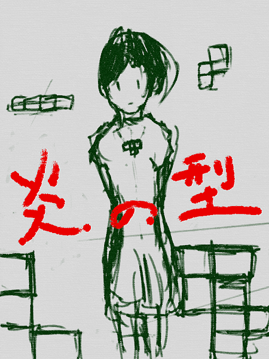

#[炎の型工房に戻る](http://firefirestyle.net/)or [Gitbook@kyorohiroに戻る](https://www.gitbook.com/@kyorohiro)

[By kyorohiro (河村潔広)](http://kyorohiro.github.io/)

# About

### 内容

本書では、Scratchを利用して、様々なゲームを作成していきます。
世界初のビデオゲームである「Tennise for two」、世界初のシューティングゲームである「Spacewar!」。アーケードでビデオゲームの地位を確立した「Pong」などのチュートリアルが収録されています。

 
 

### ことはじめ
 本文書は、CoderDojo八王子にて進行を務めるにあたり、Kyorohiroがまとめたものです。

 2015/08/16 の時点で、プログラム道場向けの日本語のプログラムのチュートリアルが少ない状態にあります。これらを、補強する目的として、チュートリアルの作成と公開をする事にしました。
　どんどん追加していきます。
https://www.gitbook.com/book/kyorohiro/firestyle/details 
 
　
### LICENSES
http://creativecommons.org/licenses/by/4.0/

この文書のライセンスはCC0で配布しています。だいだいの権利を放棄しています。

まるっとコピーしても良いです。改変して配布しても良いですし。有料で利用してもらっても良いです。これらの事がkyorohiroの断りなくできます。

 
 

  
 
 

### Table 
* [Tennis For Two <難易度 中上>](tennis_of_two/README.md)
  * [プロジェクトを作る](tennis_of_two/create_project/README.md)
  * [ボールを追加する](tennis_of_two/create_ball/README.md)
  * [自由落下](tennis_of_two/free_fall/README.md)
  * [跳ねる](tennis_of_two/bouncing_ball/README.md)
  * [左右に移動](tennis_of_two/right_left/README.md)
  * [ボールを打つ](tennis_of_two/shot_ball/README.md)
  * [Coatを作成する](tennis_of_two/create_court/README.md)
  * [完成](tennis_of_two/goal/README.md)
* [Spacewar!<難易度 上下>](spacewar/README.md) 
  * [プロジェクトを作成する](spacewar/create_project/README.md)
  * [太陽を作る](spacewar/create_sun/README.md)
  * [ロケットと重力を作る](spacewar/create_rocket/README.md)
  * [旋回機能を作る](spacewar/create_spin/README.md)
  * [推進機能を作る](spacewar/create_thrust/README.md)
  * [機雷発射機能を作る](spacewar/create_fire/README.md)
  * [的を作る](spacewar/createTarget/README.md)
  * [完成](spacewar/goal/README.md)
* [Pong <難易度 中>](pong/README.md)
  * [プロジェクトを作る](pong/create_project/README.md)
  * [ラケットを作る](pong/create_racket/README.md)
  * [ラケットを上下に移動させる](pong/create_racket/README02.md)
  * [コースを追加](pong/create_cource/README.md)
  * [ボールを追加](pong/create_ball/README.md)
  * [ボールを移動させる](pong/create_ball/README2.md)
  * [ボールが跳ね返る機能をついか](pong/bouncing/README.md)
  * [勝ち負けを判定する](pong/win_lose/README.md)
  * [打つ向きを変える](pong/direction/README.md)
  * [完成!!](pong/goal/README.md)
* [Tiny TETRIS<難易度 上上>](tetris/README.md)
  * [Table](tetris/table/README.md) 
  * [プロジェクトを作る](tetris/create_project/README.md)
  * [ネコを削除する](tetris/remove_neko/README.md)
  * [フィールドを作成する](tetris/create_board/README.md)
  * [フィールドの状態を記述する](tetris/create_board_state/README.md)
  * [フィールドに枠を表示する](tetris/create_frame/README.md)
  * [テトロミノを表示する](tetris/create_tetromino/README.md)
  * [テトロミノの種類を増やす](tetris/create_tetriminos/README.md)
  * [テトロミノの衝突判定](tetris/collision/README.md)
  * [下に移動する](tetris/down/README.md)
  * [左右に移動する](tetris/move_left/README.md)
  * [回転させる](tetris/rotate_right/README.md)
  * [クリアする](tetris/clear/README.md)
  * [テトロミノを落下させる](tetris/fall_tetromino/README.md)
  * [完成!!](tetris/goal/README.md)
* [Dojo:InkRunner <難易度 下上>](ink_runner/README.md) 
  * [プロジェクトを作る](ink_runner/create_project/README.md)
  * [xxxって何だろう?](ink_runner/what_is_inkrunner/README.md)
  * [右に移動する](ink_runner/move_character/README.md)
  * [左に移動する](ink_runner/move_left/README.md)
  * [上下に移動する](ink_runner/up_down/README.md)
  * [対戦相手を作る(1)](ink_runner/fighting_game/README.md)
  * [対戦相手を作る(2)](ink_runner/fighting_game_2/README.md)
  * [対戦相手を作る(3)](ink_runner/fighting_game_3/README.md)
  * [完成!!](ink_runner/goal/README.md)
  * [おまけ: Timer(1)](ink_runner/bonus/README.md)
  * [おまけ: Timer(2)](ink_runner/timer_2/README.md)
  * [おまけ: 判定](ink_runner/judgement/README.md)
* [Practice:Gravity<難易度 下中>](gravity/README.md)
  * [プロジェクトを作ろう](gravity/create_project/README.md)
  * [地球を作る](gravity/createSun/README.md)
  * [地球の位置とサイズを調整する](gravity/createSun/README2.md)
  * [月の大きさを調整する](gravity/createSun/README3.md)
  * [速度に応じて移動する](gravity/create_speed/README.md)
  * [引力に応じて移動する](gravity/createAttraction/README.md)
  * [軌道を記録する](gravity/createAttraction/README2.md)
  * [完成!!](gravity/goal/README.md)
  * [おまけ:向きを計算してみる]
  * [おまけ:距離を計算してみる]
* [Dojo:おにごっこ<難易度 下中>](tag/README.md)
  * [プロジェクトを作ろう](tag/create_project/README.md)
  * [右に逃げる](tag/run_chara/README.md)
  * [左に逃げる](tag/run_chara/README2.md)
  * [上下に逃げる](tag/run_chara/README3.md)
  * [鬼を作る](tag/oni/README.md)
  * [鬼が移動する](tag/oni/README2.md)
  * [捕まった時の動作](tag/tag/README.md)
  * [完成!!](tag/goal/README.md)
* [Practice:ポリゴン<難易度 中上>](polygon/README.md)
  * [プロジェクトを作る](polygon/create_project/README.md) 
  * [ネコの表示を小さくする](polygon/reduce_size/README.md)
  * [三角形を描く](polygon/draw_polygon/README.md)
  * [Matrixを定義する](polygon/matrix/README.md)
  * [Matrixの掛け算](polygon/product/README.md)
  * [Z軸に対して回転](polygon/rotateZ/README.md)
  * [X軸に対して回転](polygon/rotateX/README.md)
  * [Y軸に対して回転](polygon/rotateY/README.md)
  * [完成!!](polygon/goal/README.md)
  * [おまけ:Cubeを描く](polygon/cube/README.md)
  * [おまけ:裏と表](polygon/hiddenSurface/README.md)
* [作業テーブル:パズドラッぽいの<難易度 上中>](pazzdora/README.md)
  * [Table](pazzdora/table/README.md) 
  * [完成!!](pazzdora/goal/README.md)

# 入門者向け
炎の型は難易度が高めなので、
Scratchが初めての方向けに、Scratch を用いた プログラムの入門記事を書きました。

こたらも、どうぞ。

##### 火の型 Scratch 2.0 でプログラム入門
https://www.gitbook.com/book/kyorohiro/firestyle/details

