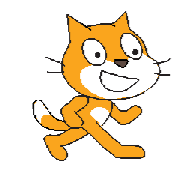
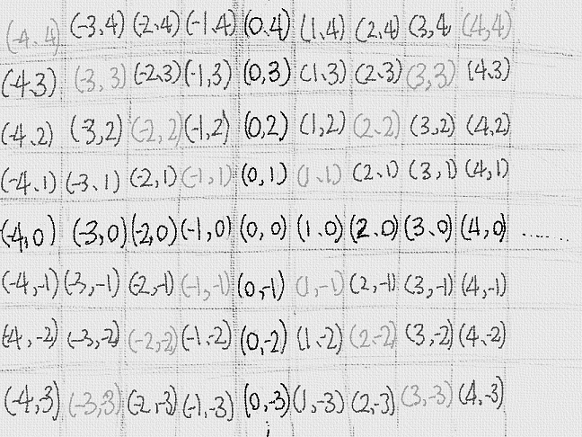

#XY座標について

キャラクターの位置は、「足し算」と「引き算」「X座標をxxにする」「y座標をxxにする」というスクリプトで変更できました。

復讐してみましょう。

パソコンの画面を拡大してみると、

と、四角形の塊で書かれています。四角形のことをピクセルといいます。scratchでは、このピクセル単位でいちを決めます。

1

### 右への移動は足し算

### 左への移動は引き算