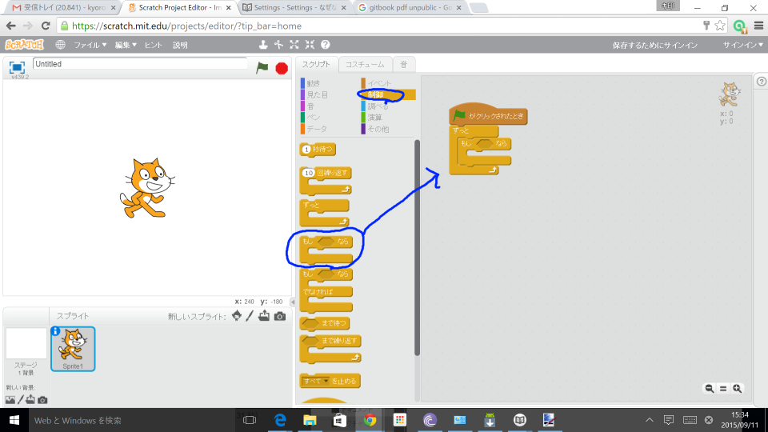
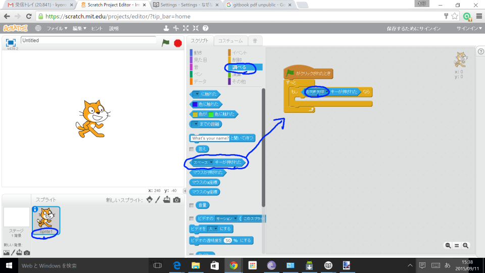

# 右に移動する

右キーを押したら、右に移動するスクリプトを追加してみよう。

### [1]スクリプト画面を表示する

##### [1-1] Sprite1を左クリック
##### [1-2] スクリプトを左クリック

### [2] コードを追します。

##### [2-1] イベントの中から「フラッグがクリックされたとき」をスクリプトに追加する

##### [2-2] 制御の中から、「ずっと」を追加する。

##### [2-3] 制御の中から、「もしxxxなら」を追加する。

##### [2-4]

# 素早く右に移動する
