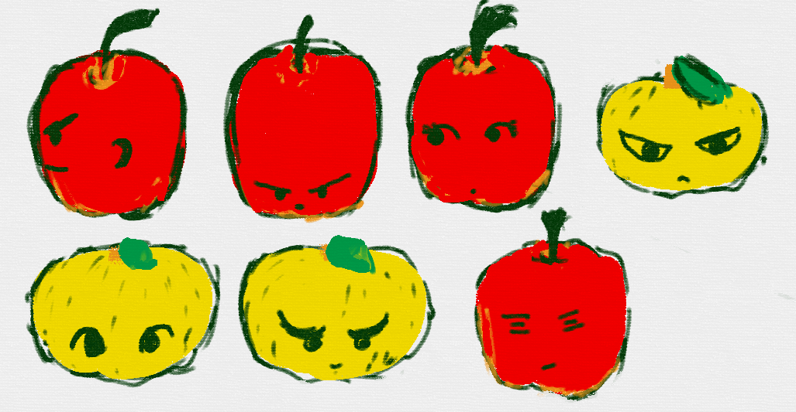

# 数字(すうじ)とは何(なに)か

## いくつあるかを伝えることができます

数を使う事で、いくつあるかを伝えることがでるようになります。

りんごが3個ある!!

みかんが5個ある!!

#### 1から10までの呼び方

#### 確認してみよう

##### Question みかんは何個ある?
 
 
 
##### Question リンゴは何個ある?
 
 
 
### 大きな値

星の数を数えよう

| 数字 |  |
| -- | -- |
|1|いち|★|
|2|に|★★|
|3|さん|★★★|
|4||★★★★|
|5||★★★★★|
|6||★★★★★★|
|7||★★★★★★★|
|8||★★★★★★★★|
|9||★★★★★★★★★|
|10||★★★★★★★★★★|
|11||★★★★★★★★★★★|
|12||★★★★★★★★★★★★|
|13||★★★★★★★★★★★★★
|14||★★★★★★★★★★★★★★|
|15||★★★★★★★★★★★★★★★|
|16||★★★★★★★★★★★★★★★★|
|17||★★★★★★★★★★★★★★★★★|
|18||★★★★★★★★★★★★★★★★★★|
|19||★★★★★★★★★★★★★★★★★★★|
|20||★★★★★★★★★★★★★★★★★★★★|
|21||★★★★★★★★★★★★★★★★★★★★★|
|22||★★★★★★★★★★★★★★★★★★★★★★|
|23||★★★★★★★★★★★★★★★★★★★★★★★|
|24||★★★★★★★★★★★★★★★★★★★★★★★★|
|25||★★★★★★★★★★★★★★★★★★★★★★★★★|
|26||★★★★★★★★★★★★★★★★★★★★★★★★★★|
|27||★★★★★★★★★★★★★★★★★★★★★★★★★★★|
|28||★★★★★★★★★★★★★★★★★★★★★★★★★★★★|
|29||★★★★★★★★★★★★★★★★★★★★★★★★★★★★★|
|30||★★★★★★★★★★★★★★★★★★★★★★★★★★★★★★|

### もっと大きな数を数えよう

