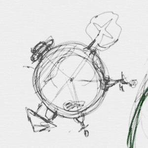
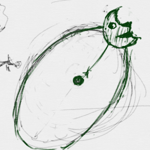
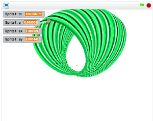

# Practice : Gravity(グラビティ)

万有引力(ばんゆういんりょく)を利用(りよう)したゲームを作成(さくせい)
できるようになってみましょう。

物体(ぶったい)どうしは、お互(たが)いに引(ひ)き付(つ)けあう力(ちから)を持(も)っています。大(おお)きくて重(おも)い物体(ぶったい)ほどその力(ちから)は強(つよ)いです。

とても微弱(びじゃく)な力(ちから)のため、太陽(たいよう)だとか、地球(ちきゅう)といったとてつもなく大(おおきな)きな物体(ぶったい)でしか観測(かんそく)することができません。

 
 

### 地球(ちきゅう)は人(ひと)や物(もの)を地面(じめん)に引(ひ)っ張(ぱ)ります

 
 
### 地球(ちきゅう)は月(つき)を引(ひ)っ張(ぱ)っています。

 
 

## Scratchで再現(さいげん)してみましょう

https://scratch.mit.edu/projects/84535698/
