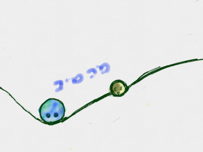
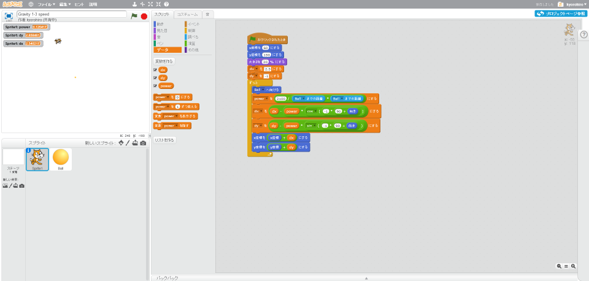
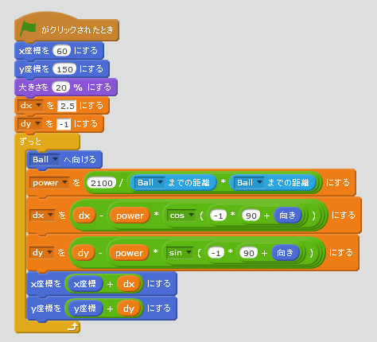
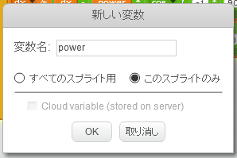
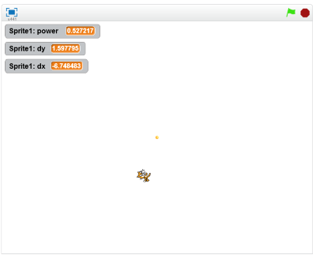

# 引力を作る

https://scratch.mit.edu/projects/87341609/

引力を追加します。

 
 
### (1) スクリプト画面を表示する

##### (1-1) Sprite1をクリック
##### (1-2) スクリプトタブをクリック

 
 

### (2) スクリプトを追加する

 

##### 注意、変数を追加する時は、"このスプライトのみ"にチェックを入れてください

 
 

### (3) 確認する

##### (3-1) 右上の旗をクリックすると、地球の周りを月が周ること

 
 
