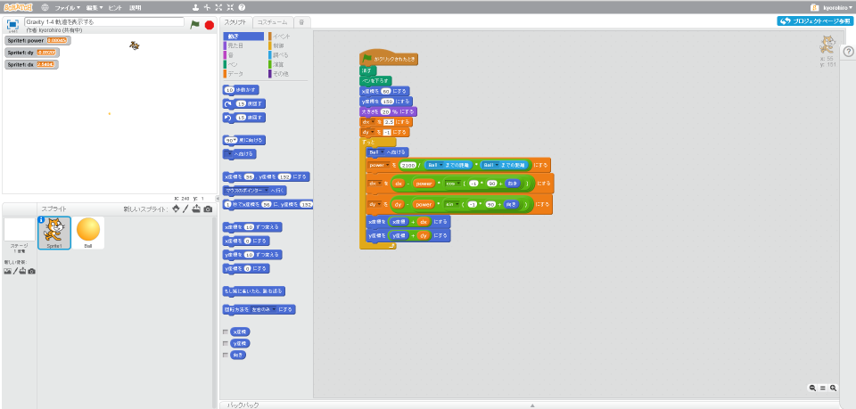
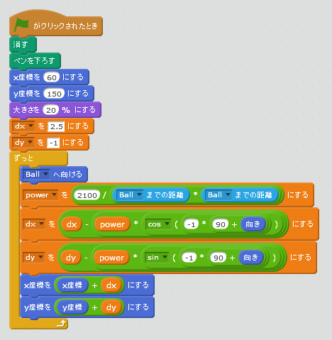
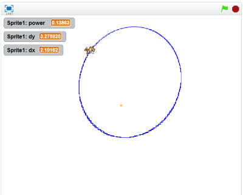

# 軌道(きせき)を表示(ひょうじ)する

月(つき)が通(とお)った軌跡(きせい)を表示(ひょうじ)してみましょう。

https://scratch.mit.edu/projects/87343886/

### (1) スクリプト画面(がめん)を表示(ひょうじ)する

##### (1-1) Sprite1をクリック
##### (1-2) スクリプトタブをクリック

 
 

### (2) スクリプトを追加(ついか)

 
 

### (3) 確認(かくにん)する
https://scratch.mit.edu/projects/87343886/

##### (3-1) Sprite1が通(とお)った後(あと)に線(せん)が引(ひ)かれること。

 
 
