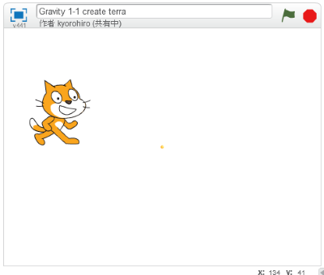

# 地球(ちきゅう)を画面(がめん)の中央(ちゅおう)に配置(はいち)する

地球(ちきゅう)を表示(ひょうじ)する位置(いち)を調整(ちょうせい)しましょう。
今回(こんかい)は中央(ちゅうおう)に配置(はいち)することにします。

 
 

### (1) スクリプト画面(がめん)を開(ひら)く

##### (1-1) ボールをクリック
##### (1-2) スクリプトタブをクリック

 
 

### (2) スクリプトを追加(ついか)する

 
 

### (3) 確認(かくにん)する

##### (3-1) 右上(みぎうえ)の旗(はた)をクリックすると、ボールが画面(がめん)の中央(ちゅうおう)に表示(ひょうじ)されること。

