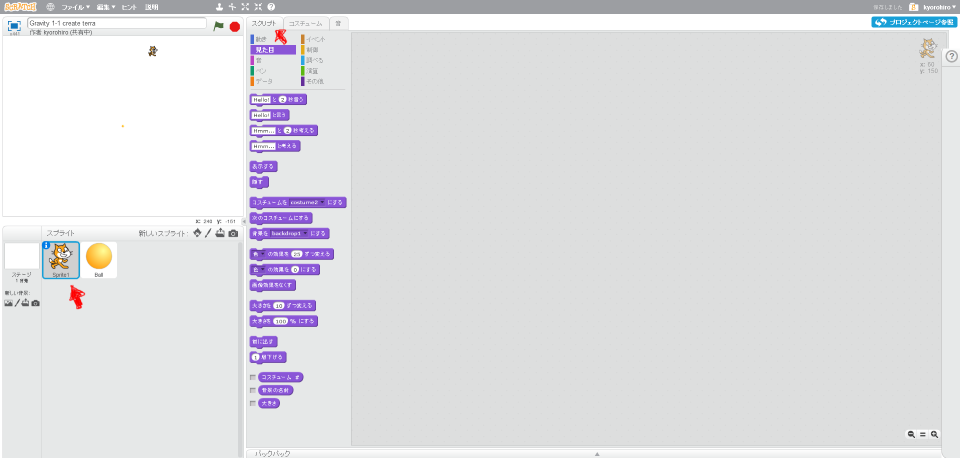

# 月(つき)の大(おお)きさも調整(ちょうせい)する

次(つぎ)は、月(つき)の大(おお)きさと位置(いち)を調整(ちょうせい)してみましょう。

 
 

### (1) スクリプト画面(がめん)を表示(ひょうじ)する

##### (1-1) Sprite1をクリックする
##### (1-2) スクリプトタブをクリックする
 
 

### (2) スクリプトを追加(ついか)する

 
 

### (3) 確認(かくにん)する

##### (3-1) 右上(みぎうえ)の旗(はた)をクリックすると、小(ちい)さく表示(ひょうじ)されること。

 
 
