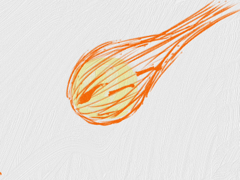
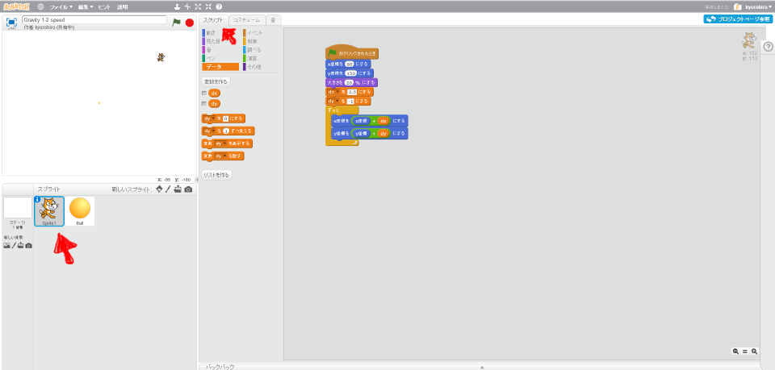
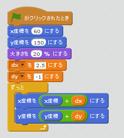
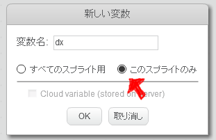

# 速度に応じて移動する

速度に応じて、キャラクターが移動する機能を追加します。

 
 

### (1) スクリプト画面を開く

##### (1-1) Sprite1をクリックする。

 
 

### (2) スクリプトを追加する

### 注意!!

変数を作る時は、このスプライトのみを選択してください。

 
 

### (3) 確認する

https://scratch.mit.edu/projects/87340452/

![con01.png]