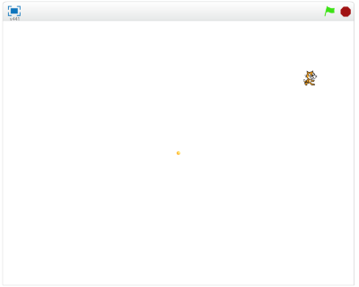

# 速度(そくど)に応(おう)じて移動(いどう)する

速度(そくど)に応(おう)じて、キャラクターが移動(いどう)する機能(きのう)を追加(ついか)してみましょう。

 
 

### (1) スクリプト画面(がめん)を開(ひら)く

##### (1-1) Sprite1をクリックする。

 
 

### (2) スクリプトを追加(ついか)する

### 注意(ちゅうい)!!

変数(へんすう)を作(つく)る時(とき)は、このスプライトのみを選択(せんたく)してください。

 
 

### (3) 確認(かくにん)する

https://scratch.mit.edu/projects/87340452/

##### (3-1) 右上(みぎうえ)の旗(はた)をクリックすると、Sprite1が右(みぎ)に移動(いどう)すること。
 
 
