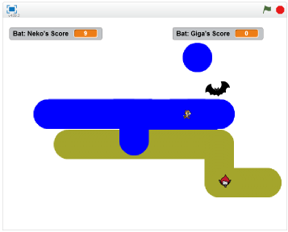

# インクランナー

CoderDojo 八王子 にて、集(あつ)まったメンバーでセッションをしながら作成(さくせい)したものです。

1時間(じかん)程度(ていど)のセッションで、Kyorohiroが進行(しんこう)を努(つとめ)めさせていただきました。

イカっぽいキャラクター達(たち)がインクを塗(ぬ)りあって陣取(じんとり)りゲームをScratchで再現(さいげん)してみようというお題(だい)で知恵(ちえ)を出(だ)し(あ)合い、それっぽいゲームが出来上(できあ)がりました。

## インクランナー
https://scratch.mit.edu/projects/78792936/

旗ボタンを押すとゲームが開始します。NekoとGigaを操作してインクを塗りあい自分のテリトリーを広げるゲームです。
30秒経過すると、Batがインクの塗られた領域を計算してスコアを表示してくれます。

