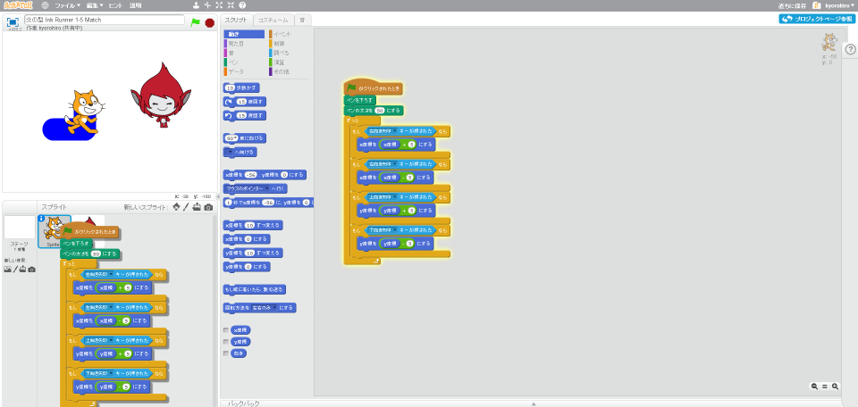
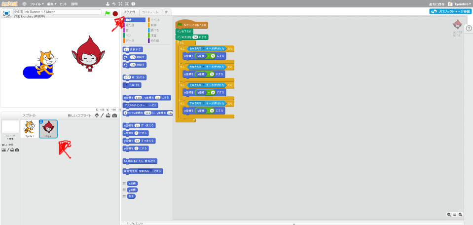
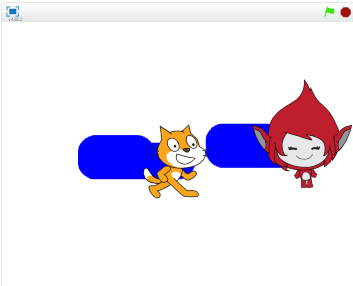

# 対戦相手(たいせんあいて)を作(つく)る

これで、画面上(がめんじょう)の好(す)きなところにインクを塗(ぬ)ることができるようになりました。

K : 次(つぎ)は何(なに)をしようか?

A : ... 対戦(たいせん)ゲームにしたい

#### キャラクターを追加(ついか)する

対戦(たいせん)ゲームなので、対戦相手(たいせんあいて)が必要(ひつよう)です。追加(ついか)してみましょう。

左下(ひだりした)のキャラクターアイコンをクリックして、Spriteを追加(ついか)する。

好(す)きなキャラクターを追加(ついか)して下さい。
私(わたし)は、Gigaを追加(ついか)します。

(1) ファンタジーを選択(せんたく)
(2) Gigaを選択(せんたく)
(3) OKを選択(せんたく)

追加(ついか)できました。

#### ネコと同(おな)じように動作(どうさ)するようにする

新(あた)しく追加(ついか)したキャラにも、ネコと同(おな)じようなコードを追加(ついか)するのですが、もう一度(いちど)同(おな)じコードを書(か)くのは面倒(めんどう)なので、ネコのスクリプトを再利用(さいりよう)します。

ネコをクリックした後、右上のスクリプトタブをクリックする。
 にマウスカーソルを合わせて、右クリックします。
メニューリストの中の「複製」を選択してください。

そして、新しく追加したキャラクターの上で、もう一度クリックしてください。
スクリプトがコピーされます。

#### 確認する

新しく追加したキャラクターをクリック
右上のスクリプトタブをクリック

ネコ用に作成したスクリプトが存在していれば成功です。

#### 動作確認する
https://scratch.mit.edu/projects/79077708/

動作確認してみましょう。上下左右キーに応じてキャラクターが移動します。

