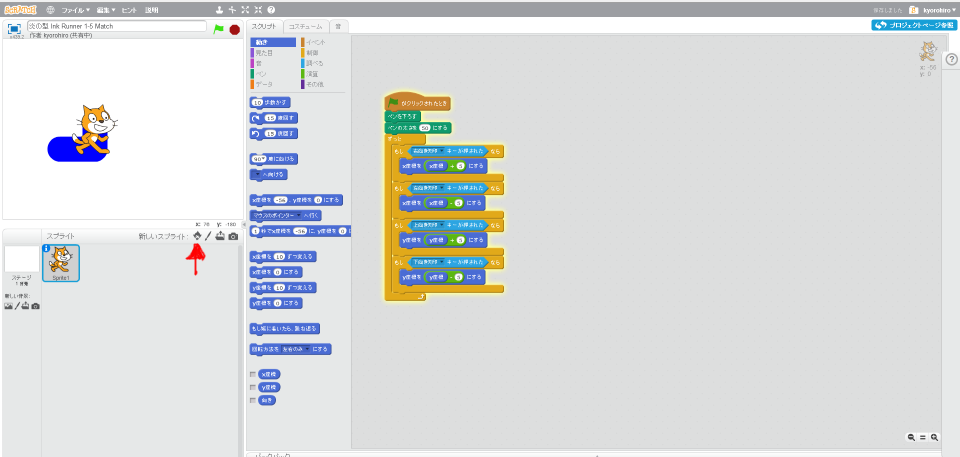
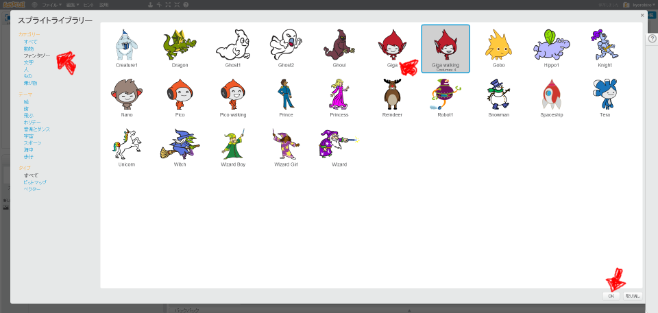
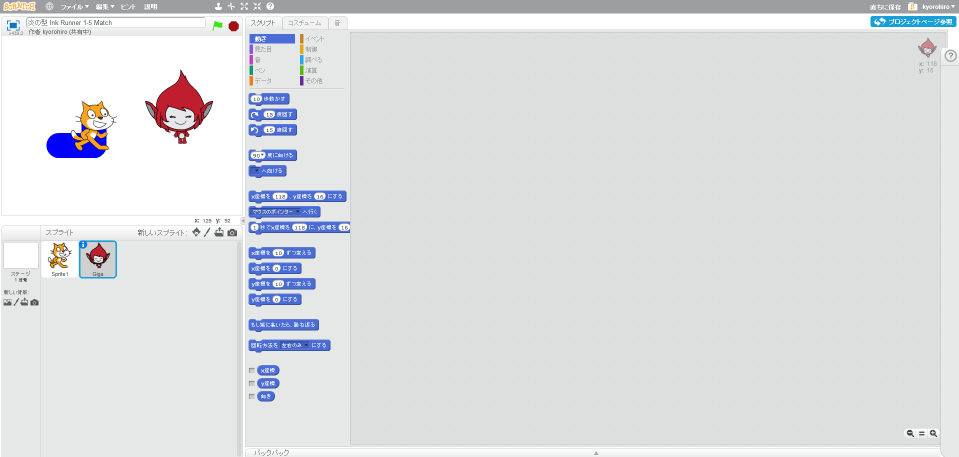

# 対戦相手を作る

これで、画面上好きなところにインクを塗ることができるようになりました。

K : 次は何をしようか?

A : ..対戦ゲームにしたい

#### キャラクターを追加する

対戦ゲームなので、キャラクターが2対必要です。追加してみましょう。

#### ネコと同じように動作するようにする

新しく追加したキャラにも、ネコと同じようなコードを追加するのですが、もう一度同じコードを書くのは面倒なので、ネコのスクリプトを再利用します。

ネコをクリックした後、右上のスクリプトタブをクリックする。
 にマウスカーソルを合わせて、右クリックします。
メニューリストの中の「複製」を選択してください。

