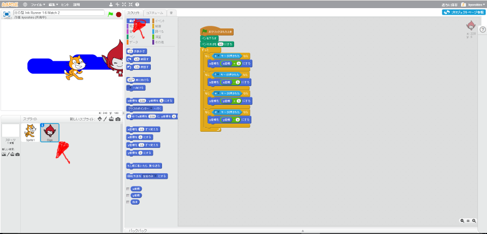
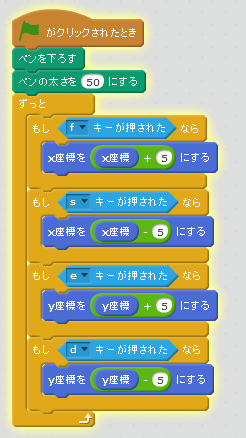

# キーの割当(わりあて)を変(か)える。

新(あたら)しく追加(ついか)したキャラクターのキー割当(わりあて)を変更(へんこう)しましょう。

(1) 新しく追加したキャラをクリックいて、スクリプト画面を開く。

上記(じょうき)のようにキー配置(はいち)を変更(へんこう)してみましょう。

キー配置は、変えても良いとおもいます。
お好みで配置してください。

#### 動作確認してみよう

https://scratch.mit.edu/projects/79077708/

Sキー, Fキー, Eキー, Dキー を押すと新しく追加したキャラクターが上下左右に動作することを確認してください。
