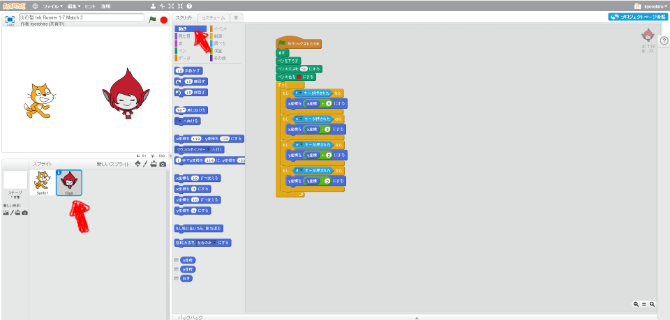

# インクの色(いろ)を変(か)える

インクの色(いろ)を変(か)えて、陣取(じんと)りゲームをできるようにしましょう。

#### ネコのペンの色(いろ)を青(あお)にする

左下(ひだりした)のネコのキャラクターを選択して、スクリプト画面を開いてください。

上記のようなスクリプトを追加してください。

#### Gigaのペンの色(いろ)を赤(あか)にする

左下(ひだりした)のGigaのキャラクタ
ーを選択して、スクリプト画面を開いてください。

上記のようなスクリプトを追加してください。

# 確認してみよう

https://scratch.mit.edu/projects/79097520/

