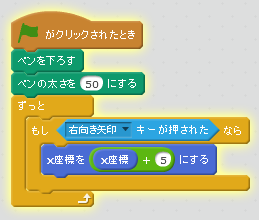
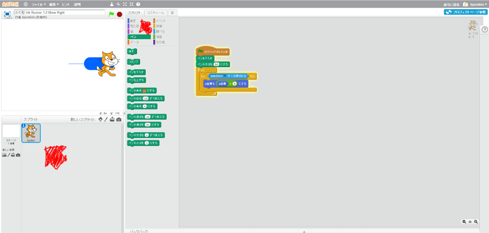
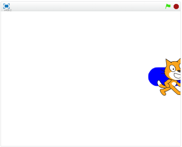

# 右(みぎ)へ移動(いどう)する

K : 「次にどんな機能を追加しようか!」
K : 「どうしたら、ゲームっぽうなるかな?」
A : 「インクを画面に塗りたい」
K : 「じゃ、キャラクターを、操作してみようか!!」

#### 右(みぎ)に移動(いどう)する機能(きのう)

では、このスクリプトを追加(ついか)してみましょう。右(みぎ)キーを押(お)すと、右(みぎ)に移動(いどう)します。

ネコのキャラクターをクリックして、右上(みぎうえ)のスクリプトタブをクリックすると、スクリプト画面(がめん)が表示(ひょうじ)されます。

そこに、このスクリプトを追加(ついか)してみてください。
「10回繰り返す」の部分(ぶぶん)を、「ずっと」に変(か)えたので注意(ちゅうい)してください。

#### 動作確認

では、上手く書けたか確認してみましょう。「右キー」を押したら、右に移動する王になったかな?

https://scratch.mit.edu/projects/79058386/

右上の緑の旗をクリックしてください。
そのあとで、右キーを押してください。
キャラクターが右に移動したならば、良い感じです。

