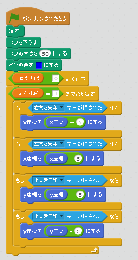

# 試合(しあい)が完了(かんりょう)したら動(うご)けなくなる

#### 蝙蝠(こうもり)にスクリプトを追加(ついか)する

「しゅうりょう」の変数(へんすう)は、「すべてのスプライト用」にチェックを付(つ)けて作成(さくせい)してくださ。

#### ネコにスクリプトを追加する

#### Gigaにスクリプトを追加する 

#### 確認(かくにん)する

https://scratch.mit.edu/projects/79109154/

30秒経過するとキー操作でキャラクターが移動しまくなることを確認してください。

