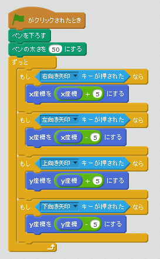

# 上下(じょうげ)に移動(いどう)する

次(つぎ)は、上下(じょうげ)に移動(いどう)させてみましょう。これで、画面上(がめんじょう)を自由(じゆう)に動(うご)まわることが出来(でき)るようになります。

こんな感(かんじ)じです。左右(さゆう)への移動(いどう)はX座標(ざひょう)でした、上下(じょうげ)の移動(いどう)はY座標(ざひょう)を変更(へんこう)します。

#### 確認(かくにん)してみよう

https://scratch.mit.edu/projects/79073124/

上手(うまく)く書(か)けたか確認(かくにん)してみましょう。思(おも)った通(とお)りに動作(どうさ)していますか?

ゲームを作(つく)るときは、このように、こまめに動作確認(どうさかくにん)しながら、完成(かんせい)させていきます。

