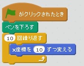
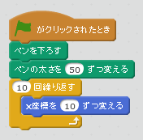
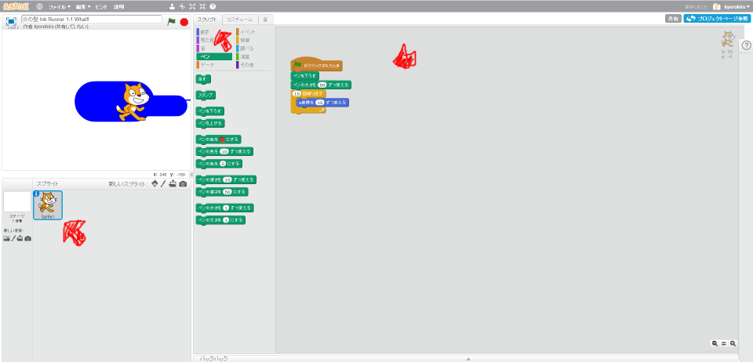

# インクランナーとは何か

K:「スプラトゥーンって、どんなゲーム?」

K:「誰か教えて」

A:「シューチングゲーム」

K:「やば、シューチングゲームだったっけ」「実はやったことないんだよね」

K:「インクを塗りあうゲームでもあるんだよね？あってる？」

A: 「そうそう、陣取りゲームなの」

#### インクをScratchで再現する

このコードを追加して、Scratchで線を引くことができます。

とすると、線が太くなります。インクっぽく見えないかな？

................

.......

....

#### コードを追加する
まずは、このコードを書いてみようか!!

このネコのキャラクターをクリックして。右上のスクリプトTabをクリックすると、スクリプトが追加できます。

まずは追加してみましょう。

