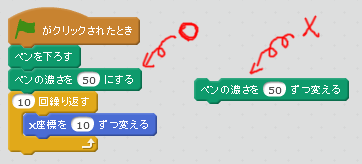
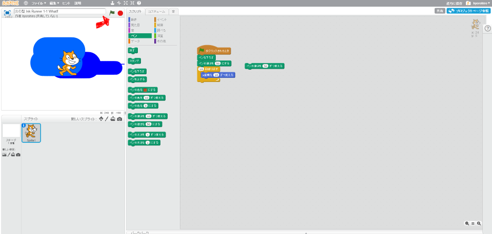

# インクランナーとは何(なに)か

K:「スプラトゥーンって、どんなゲーム?」

K:「誰(だれ)か教(おし)えて」

A:「シューチングゲーム」

K:「やば、シューチングゲームだったっけ」「実(じつ)はやったことないんだよね」

K:「インクを塗(ぬ)りあうゲームでもあるんだよね？あってる？」

A: 「そうそう、陣取(じんと)りゲームなの」

#### インクをScratchで再現(さいげん)する

このコードを追加(ついか)して、Scratchで線(せん)を引(ひ)くことができます。

とすると、線(せん)が太(ふと)くなります。インクっぽく見(み)えないかな？

................

.......

....

#### コードを追加する
まずは、このコードを書いてみようか!!

このネコのキャラクターをクリックして。右上のスクリプトTabをクリックすると、スクリプトが追加できます。

まずは、このコードを追加してみましょう。

##### 間違いを発見

K : 「ごめんなさい、このコードには間違いがあります。今のままだとゲームを開始するたびに、ペンの太さが大きくなってしまいます。」

K :「ペンの濃さを50にする」に変えてください

#### 動作確認

できたら、動作確認してみましょう。

左上の緑色の旗をクリックしてください。キャラクターが右に動くことがわかるでしょうか。
みなさんの描いたコードもきたい通りに動作していますか?

