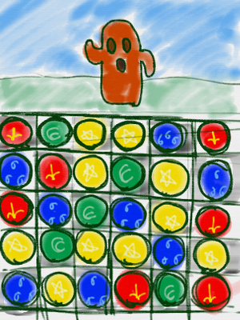
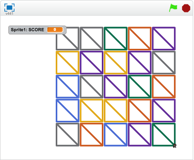

# パズドラっぽいの

パズドラのパズルゲームの部分を作っていきましょう。

パズル&ドラゴンズ は、ガンホー・オンライン・エンターテイメント株式会社から配信されているパズルRPGゲームです。

6x5　ないし 6x6 のマスに、ドロップが配置されていて、このドロップを縦横に3つ揃えると、
ドロップが消滅します。このドロップを効率よく消すパズルケームです。

ドロップが消滅した分だけモンスターへダメージを与える事ができ、
ゲームを進める事ができます。

https://ja.wikipedia.org/wiki/パズル%26ドラゴンズ

# Scratchで再現してみよう

https://scratch.mit.edu/projects/89631068/

マウスでプロックをドラッグ&デロップする事で、ドロップの位置を変更する事ができます。
縦 or 横に3つ同じ色が揃うと、揃ったブロックが消えます。
消したプロックの数だけ得点が入ります
