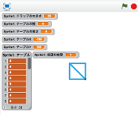

# 作業記録
すぐに実装できそうなところから、順に少しずつ機能追加していきます。
何度も作りなおす事になると思います。
徐々に理解を深めながら、ゴールを目指しましょう。

## ドロップを描画する

https://scratch.mit.edu/projects/91284919/

ゲームで使用するドロップを描画する機能を追加します。

 
## ドロップを生成する

https://scratch.mit.edu/projects/91290061/

今回つくるゲームでは、36個のドロップを使用します。
これらのドロップは6x6テーブルに表示されます。
ここでは、これらのドロップを、Listで管理する機能を追加します。

 

## Tableを描画する

https://scratch.mit.edu/projects/91341934/
生成したドロップを表示してみましょう。

 

## ドロップを選択できるようにする

https://scratch.mit.edu/projects/91343315/

マウスが押された時のドロップの位置を記録してみる。

 

## ドロップを移動する

ドロップを移動して、

## ドロップをクリアする

## クリアした分だけドロップを追加する

## 完成
