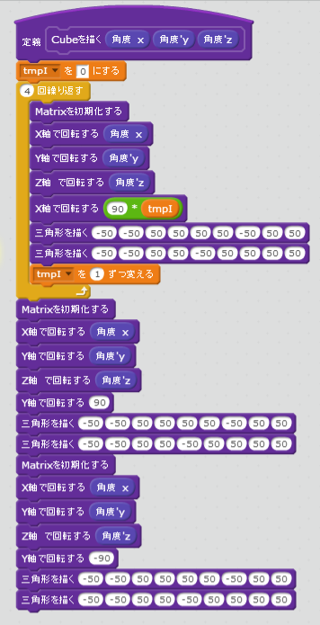
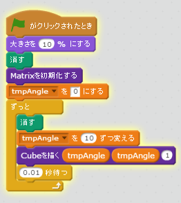
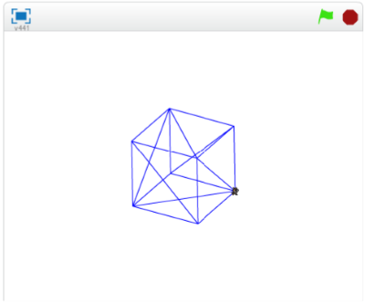

# Cubeを描()かく

ポリゴンが描(か)けるようになりました。代表的(だいひょうてき)な3Dオブジェクトを描(か)いてみましょう。

今回(こんかい)はCubeを表示(ひょうじ)してみます。

https://scratch.mit.edu/projects/88199921/

### (1) Cubeを表示(ひょうじ)するスクリプトを追加(ついか)する

### (2) 旗(はた)がクリックされたとき、Cubeを表示(ひょうじ)するようにする

### (3) 確認(かくにん)する

##### (3-1) 右上(みぎうえ)の旗(はた)アイコンをクリックする
##### (3-2) Cubeが表示(ひょうじ)されること

