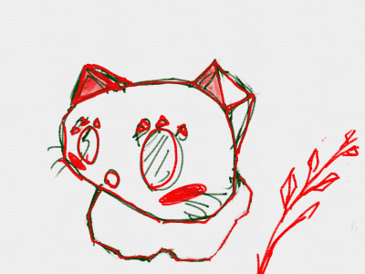

# ポリゴンを描(か)く

3Dは三角形(さんかっけい)の集(あつ)まりで表現(ひょうげん)します。この三角形(さんかっけい)のことをポリゴンと呼(よ)んでいます。

ポリゴンを表示(ひょうじ)してみましょう。

### (1) スクリプト画面(がめん)を表示(ひょうじ)する

 
 

### (2) スクリプトを追加(ついか)する

 
 

### (2 注意) ブロックを場合(ばあい)は、「画面を再描画せずに実行する」にチェックを入(い)れてください。

 
 

### (3) 確認(かくにん)する
https://scratch.mit.edu/projects/87995338/

##### (3-1) 右上の旗アイコンをクリックする
##### (3-2) 三角形が表示されること

 
 

### (4) Good!!

