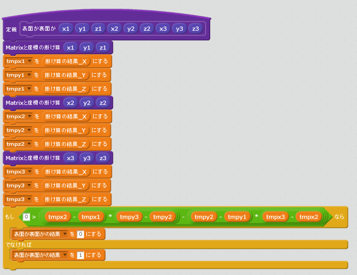
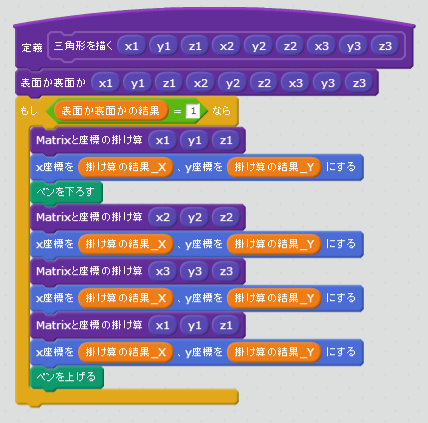
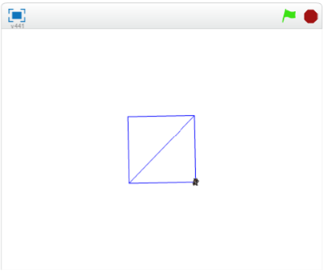

# ポリゴンの裏(うら)と表(おもて)

Cubeを表示(ひょうじ)すると、Aのように表示(ひょうじ)されたと思(おも)います。
Bのように、裏側(うらがわ)が透(す)けないように表示(ひょうじ)するにはどうすれば良(よ)いでしょうか。

色々(いろいろ)な方法(ほうほう)があります。ここでは法線(ほうせん)を利用(りよう)する方法(ほうほう)を紹介(しょうかい)します。

 
 

### Polygonは裏(うら)と表(おもて)を持(も)っている。

Ploygonには、裏(うら)と表(おもて)があります。表面(おもてめん)は画面(がめん)に表示(ひょうじ)されますが、裏面(うらめん)は画面(がめん)に表示(ひょうじ)されません。

上図(じょうず)のように、反時計回(はんとけいまわ)りが表(おもて)。　時計周(とけいまわ)りが裏(うら)です。

 

面倒(めんどう)ですね。Polygonで図形(づけい)を書(か)くときは、常(つね)に意識(いしき)しないといけません。

気(き)を抜(ぬ)くと、上(うえ)のように透(す)けてしまします。

 
 

### (1) 上手(うま)く使(つか)えば、裏側(うらがわ)が透(す)けない立方体(りっぽうたい)をかける。

 上図(じょうず)のAのように、渦(うず)が「反時計回り」に見(み)えているものが、180度(ど)回転(かいてん)すると、上図(じょうず)のCのように「時計回りに」に見(み)えます。つまり、180度(ど)回転(かいてん)すると表示(ひょうじ)されなくなります。

例(たと)えば、上図(じょうず)のようにすると、いくら回転(かいてん)しても裏側(うらがわ)が透(す)けて見(み)えないCubeを書(か)くことができます。

 
 

### 右回(みぎまわ)りか、左回(ひだりまわ)りかの判定方法(はんていほうほう)

右回(みぎまわ)りか、左回(ひだりまわ)りかの判定(はんてい)をする機能(きのう)をついかする必要(ひつよう)があります。

この判定(はんてい)には、以下(いか)の数式(すうしき)が使(つか)われること多(おお)いです。

$$\left(
  \begin{array}{ccc}
  x_{1} & y_{1} & z_{1}\\
  \end{array}
\right)\\$$,　$$\left(
  \begin{array}{ccc}
  x_{2} & y_{2} & z_{2}\\
  \end{array}
\right)\\$$,　$$\left(
  \begin{array}{ccc}
  x_{3} & y_{3} & z_{3}\\
  \end{array}
\right)\\$$ の三点を通る三角形の場合
$$v = \left(x_{2}-x_{1}\right) \times \left(y_{3}-y_{2}\right)
- \left(y_{2}-y_{1}\right)\times\left(x_{3}-x_{2}\right)
$$

で、$$v$$ が、0よりも大(おおきい)きい場合(ばあい)は「表(おもて)」、小(ちいい)さい場合(ばあい)は「裏(うら)」と判断(はんだん)できます。

 
 

## (B) Scratchで実装(じっそう)する

### (1) 裏表(うらおもて)を判定(はんてい)するスクリプトを追加(ついか)する

 
 
### (2) ポリゴンを描画時(びょうがじ)に、裏表判定(うらおもてはんてい)を使用(しよう)するようにする

 
 

### (3) 確認(かくにん)する

https://scratch.mit.edu/projects/88197759/

##### (3-1) 右上(みぎうえ)の旗(はた)アイコンをクリックすると、Cubeが回転(かいてん)すること
##### (3-2) 裏側(うらがわ)が透(す)けて見(み)えないこと。

 
 
### (4) Good!

よくできました。次(つぎ)のステップに進(すす)みましょう。

