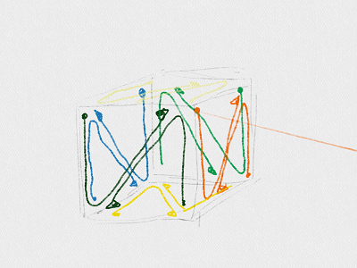

# 裏と表

https://scratch.mit.edu/projects/88197759/

Cubeを表示すると、Aのように表示されたと思います。
Bのように表示するにはどうすれば良いでしょうか。

色々な方法があります。ここでは法線を利用する方法を紹介します。

 
 

### Polygonは裏と表を持っている。

Ploygonには、裏と表があります。表面は画面に表示されますが、裏面は画面に表示されません。

上図のように、反時計回りが表。　時計周りが裏です。

 

面倒ですね。Polygonで図形を書くときは、常に意識しないといけません。
気を抜くと、透けてしまします。

 
 

### (1) 上手く使えば、裏側が透けない立方体をかける。

 上図のAのように、渦が「反時計回り」に見えているものが、180度回転すると、上図のCのように「時計回りに」に見えます。つまり、180度回転すると表示されなくなります。

例えば、上図のようにすると、いくら回転しても裏側が透けて見えないCubeを書くことができます。

 
 

### 右回りか、左回りかの判定方法

右回りなのか、左回りなのかの判定には、数式が使われること多いです。

$$

$$

## (B) Scratchで実装する

##

