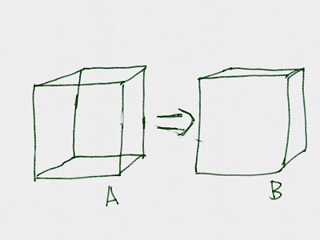
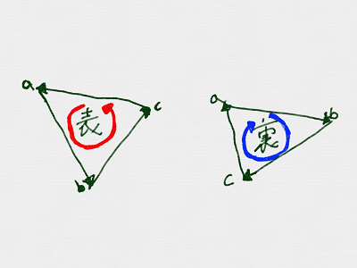
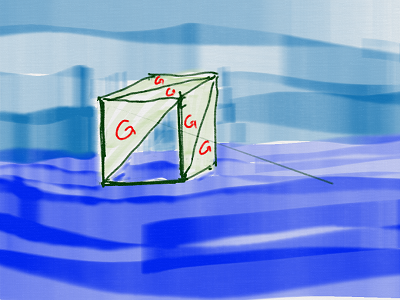
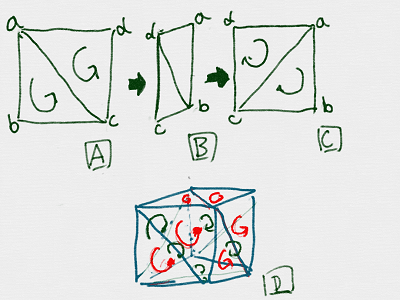

# 裏と表

https://scratch.mit.edu/projects/88197759/

Cubeを表示すると、Aのように表示されたと思います。
Bのように表示するにはどうすれば良いでしょうか。

色々な方法があります。ここでは法線を利用する方法を紹介します。

 
 

### Polygonは裏と表を持っている。

Ploygonには、裏と表があります。表面は画面に表示されますが、裏面は画面に表示されません。

上図のように、反時計回りが表。　時計周りが裏です。

 

面倒ですね。Polygonで図形を書くときは、常に意識しないといけません。
気を抜くと、透けてしまします。

ポリゴンは裏と表を持ちます。「a→c→d→a」の順で三角形を、表示した場合を表、「a→d→d→c→a」の順に三角形を表示した場合を裏とします。

表の場合は、「反時計回り」の順で描画している場合を表、時計回りの順で描画してる場合を裏としています。

####  180度回転すると、「反時計回りの渦」が「時計回りの渦に」みえる。

上図のAのように、渦が「反時計回り」に見えているものが、180度回転すると、上図のCのように「時計回りに」に見えます。

表側のみ描画するようにすると、Bのように、裏側が表示されなくなります。

 
 
## (B) Scratchで実装する

##

