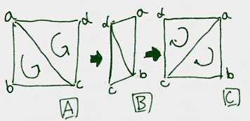

# 裏と表

https://scratch.mit.edu/projects/88197759/

Cubeを表示すると、Aのように表示されたと思います。
Bのように表示するにはどうすれば良いでしょうか。

色々な方法があります。ここでは法線を利用する方法を試してみます。

### 裏と表を定義する

「a→c→d→a」の順で三角形を、表示した場合を表、「a→d→d→c→a」 の順に三角形を表示した場合を裏とします。

表の場合は、「反時計回り」の順で描画している場合を表、時計回りの順で描画してる場合を裏としています。

