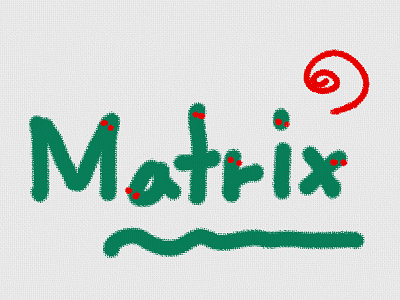

# Matrixを定義(ていぎ)する

3Dは数学的(すうがくてき)な表現(ひょうげん)が利用(りよう)されます。ひのひとつがMatrixです。日本語(にほんご)では行列(ぎょうれつ)といいます。2012年までは高校(こうこう)でならっていました。いまは、理系(りけに)の大学(だいがく)で習(なら)います。

しかし、3Dを扱(あつか)うならは必須(ひっす)の知識(ちしき)です。そして、理系(りけい)の大学生(だいがくせい)が習(なら)う数学(すうがく)ですが、使(つか)うだけなら簡単(かんだん)です。

トライしまみましょう。

 
 
## (A) Matixとは数(かず)の集(あつ)まり

$$\left(
  \begin{array}{ccc}
    a_{11} & a_{12} & a_{13} & a_{14}\\
    a_{21} & a_{22} & a_{23} & a_{24}\\
    a_{31} & a_{32} & a_{33} & a_{34}\\
    a_{41} & a_{42} & a_{43} & a_{44}\\
  \end{array}
\right)$$

Matrix にも色々(いろいろ)な種類(しゅるい)がありますが、3Dで扱(あつか)うのは、上記(じょうき)のような、横幅(よこはば)が4、縦幅(たてはば)が4のMatrixです。

※ $$a_{11}$$から$$a_{44}$$ には数字(すうじ)が入ります。

 

例(たと)えば、以下(いか)のように書(か)けます。

$$\left(
  \begin{array}{ccc}
    1 & 0 & 0 & 0\\
    0 & 1 & 0 & 0\\
    0 & 0 & 1 & 0\\
    0 & 0 & 0 & 1\\
  \end{array}
\right)$$

※  あとで解説(かいせつ)しますが、この行列(ぎょうれつ)は特殊(とくしゅ)です。

 
 

## (B) これを、Scratchで表現(ひょうげん)してみましょう。
### (1) Scripte画面(がめん)を表示(ひょうじ)する

##### (1-1) 左下(ひだりした)のSprite1をクリックする

##### (1-2) スクリプトタブをクリックする

 
 

### (2) Scriptを追加(ついか)する

##### (2-注意)

※ このSpriteのみにチェックを入(い)れました。

※  「画面を詐病がせずに実行する」にチェックを入(い)れてください

 
 

### (3) 確認する

今回の変更では、振る舞いが変わらないので、コードをチェックしましょう。
##### (3-1) 「Matrixを初期化する」定義が、あること
##### (3-2) 「16回」値を追加していること
##### (3-3) 値を追加する前に すべてのデーターを削除していること
##### (3-4) {1,0,0,0} {0,1,0,0} {0,0,1,0} {0,0,0,1} と順に値が追加されていること

 
 

### (4) Good !

よくできました。次(つぎ)のステップに進(すす)みましょう。

