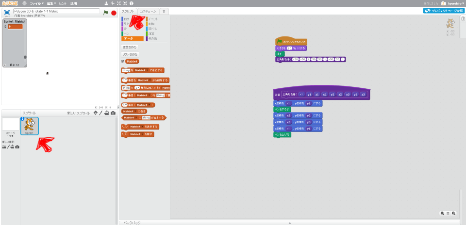
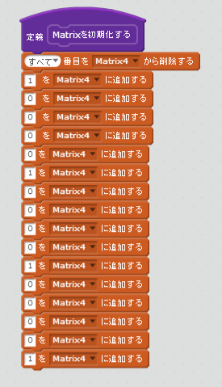
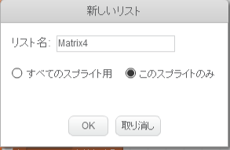
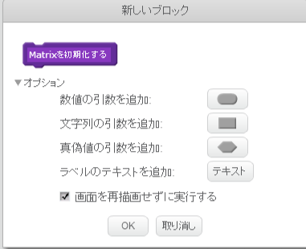

# Matrixを定義する

3Dは数学的な表現が利用されます。ひのひとつがMatrixです。日本語では行列といいます。2012年までは高校でならっていました。いまは、理系の大学で習います。

しかし、3Dを扱うならは必須の知識です。そして、理系の大学生が習う数学ですが、使うだけなら簡単です。覚えてしまいましょう。

 
 
## (A) Matixとは数の集まり

$$\left(
  \begin{array}{ccc}
    a_{11} & a_{12} & a_{13} & a_{14}\\
    a_{21} & a_{22} & a_{23} & a_{24}\\
    a_{31} & a_{32} & a_{33} & a_{34}\\
    a_{41} & a_{42} & a_{43} & a_{44}\\
  \end{array}
\right)$$

Matrix にも色々な種類がありますが、3Dで扱うのは、上記のような、横幅が4、縦幅が4のMatrixです。
$$a_{11}$$から$$a_{44}$$ には数字が入ります。

 

例えば、以下のように書けます。

$$\left(
  \begin{array}{ccc}
    1 & 0 & 0 & 0\\
    0 & 1 & 0 & 0\\
    0 & 0 & 1 & 0\\
    0 & 0 & 0 & 1\\
  \end{array}
\right)$$

 
 

## (B) これを、Scratchで表現してみましょう。
### (1) Scripte画面を表示する

##### (1-1) 左下のSprite1をクリックする

##### (1-2) スクリプトタブをクリックする

 
 

### (2) Scriptを追加する

##### (2-注意)

※ このSpriteのみにチェックを入れました。

※  「画面を詐病がせずに実行する」にチェックを入れてください

 
 

### (3) 確認する

今回の変更では、振る舞いが変わらないので、コードをチェックしましょう。
##### (3-1) 「Matrixを初期化する」定義が、あること
##### (3-2) 「16回」値を追加していること
##### (3-3) 値を追加する前に すべてのデーターを削除していること
##### (3-4) {1,0,0,0} {0,1,0,0} {0,0,1,0} {0,0,0,1} と順に値が追加されていること

 
 

### (4) Good !

