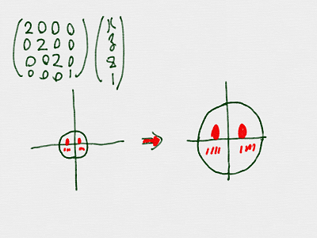
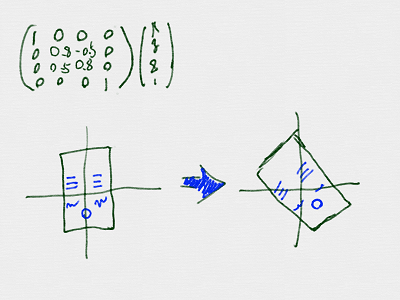

# Matrixの掛(か)け算(ざん)

https://scratch.mit.edu/projects/88081061/

Matrixにも、足(た)し算(ざん)、引(ひ)き算(ざん)、掛(か)け算(ざん)などがあります。

掛(か)け算(ざん)について学(まな)びましょう。

## 掛(か)け算(ざん)

$$ \left(
\begin{array}{ccc}
x_{next} \\
y_{next} \\
z_{next} \\
1 \\
\end{array}
\right)
=
\left(\begin{array}{ccc}
\\
行列\\
\\
\end{array}
\right)
\left(
\begin{array}{ccc}
x \\
y \\
z \\
1 \\
\end{array}
\right)
$$

こんな感(かん)じて、掛(か)け算(ざん)する事(こと)で、ポリゴンを、引(ひ)き延(の)ばしたり、回転(かいてん)させたりすることができます。

※ $$\left(x_{next},y_{next},z_{next}\right)$$が変換後(へんかんご)の位置(いち)です。

#### 2倍(ばい)に拡大(かくだい)

#### 30度(ど)回転(かいてん)

 
 

### 掛(か)け算(ざん)のルール

$$ \left(
\begin{array}{ccc}
x_{next} \\
y_{next} \\
z_{next} \\
1 \\
\end{array}
\right)
=
\left(
  \begin{array}{ccc}
    a_{11} & a_{12} & a_{13} & a_{14}\\
    a_{21} & a_{22} & a_{23} & a_{24}\\
    a_{31} & a_{32} & a_{33} & a_{34}\\
    a_{41} & a_{42} & a_{43} & a_{44}\\
  \end{array}
\right)
\left(
\begin{array}{ccc}
x \\
y \\
z \\
1 \\
\end{array}
\right)
=
\left(
\begin{array}{ccc}
a_{11} \times x + a_{12} \times y + a_{13} \times z + a_{14} \times 1\\
a_{21} \times x + a_{22} \times y + a_{23} \times z + a_{24} \times 1\\
a_{31} \times x + a_{32} \times y + a_{33} \times z + a_{34} \times 1\\
a_{41} \times x + a_{42} \times y + a_{43} \times z + a_{44} \times 1\\
\end{array}
\right)
$$

掛(か)け算(ざん)のルールはこんな感(かん)じです。これを、Scratchで実装(じっそう)してみましょう。

 
 

## (B) Scratchで実装(じっそう)してみる
### (1) スクリプト画面(がめん)を表示(ひょうじ)する

##### (1-1) 左下(ひだりした)のSprite1をクリックする
##### (1-2) スクリプトタブをクリックする

 
 

### (2) 掛(か)け算(ざん)するスクリブトを追加(ついか)する

 
 

### (3) ポリゴンを表示(ひょうじ)するスクリブトを修正(しゅうせい)する

 
 

### (4) 確認(かくにん)してみよう
https://scratch.mit.edu/projects/88081061/

##### (4-1) 旗(はた)がクリックされた時(とき)のスクリプトを変更(へんこう)する。

##### (4-2) 右上(みぎうえ)の旗(はた)アイコンをクリックする 

##### (4-3) 三角形(さんかっけい)が表示(ひょうじ)されること

 
 

### (5) Good!!

よくできました。次(つぎ)のステップに進(すす)みましょう。

