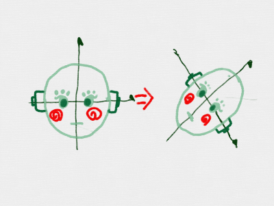
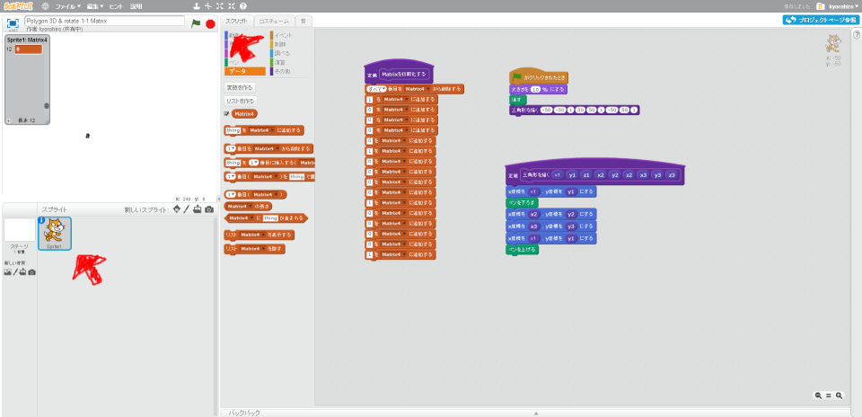
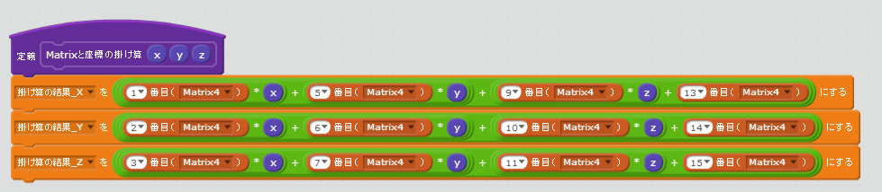
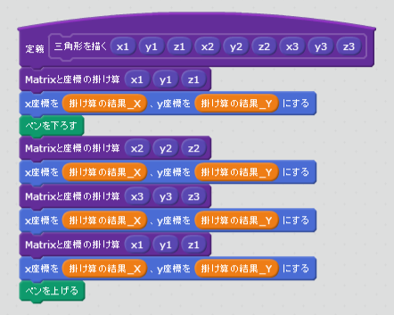
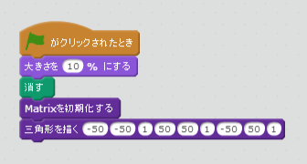
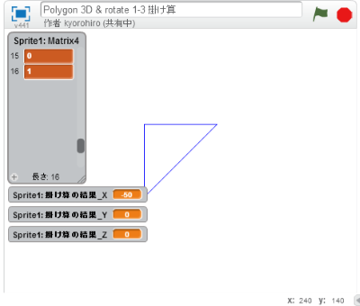

# Matrixの掛(か)け算(ざん)

https://scratch.mit.edu/projects/88081061/

Matrixにも、足(た)し算(ざん)、引(ひ)き算(ざん)、掛(か)け算(ざん)などがあります。

掛(か)け算(ざん)について学(まなび)びましょう。

## 掛(か)け算(ざん)

$$ \left(
\begin{array}{ccc}
x_{next} \\
y_{next} \\
z_{next} \\
1 \\
\end{array}
\right)
=
\left(\begin{array}{ccc}
\\
行列\\
\\
\end{array}
\right)
\left(
\begin{array}{ccc}
x \\
y \\
z \\
1 \\
\end{array}
\right)
$$

こんな感じて、掛け算する事で、ポリゴンを、引き延ばしたり、回転させたりすることができます。

$$\left(x_{next},y_{next},z_{next}\right)$$が変換後の位置になります。

#### 拡大

 

Matrixの掛け算を実装してみましょう。

### 掛け算のルール

$$ \left(
\begin{array}{ccc}
x_{next} \\
y_{next} \\
z_{next} \\
1 \\
\end{array}
\right)
=
\left(
  \begin{array}{ccc}
    a_{11} & a_{12} & a_{13} & a_{14}\\
    a_{21} & a_{22} & a_{23} & a_{24}\\
    a_{31} & a_{32} & a_{33} & a_{34}\\
    a_{41} & a_{42} & a_{43} & a_{44}\\
  \end{array}
\right)
\left(
\begin{array}{ccc}
x \\
y \\
z \\
1 \\
\end{array}
\right)
=
\left(
\begin{array}{ccc}
a_{11} \times x + a_{12} \times y + a_{13} \times z + a_{14} \times 1\\
a_{21} \times x + a_{22} \times y + a_{23} \times z + a_{24} \times 1\\
a_{31} \times x + a_{32} \times y + a_{33} \times z + a_{34} \times 1\\
a_{41} \times x + a_{42} \times y + a_{43} \times z + a_{44} \times 1\\
\end{array}
\right)
$$

掛け算のルールはこんな感じです。これを実走してみましょう。

 
 

## (B) Scratchで実装してみる
### (1) スクリプト画面を表示する

##### (1-1) 左下のSprite1をクリックする
##### (1-2) スクリプトタブをクリックする

 
 

### (2) 掛け算するスクリブトを追加する

 
 

### (3) 三角形を各スクリブトを修正する

 
 

### (4) 確認してみよう
https://scratch.mit.edu/projects/88081061/

##### (4-1) 旗がクリックされた時のスクリプトを変更する。

##### (4-2) 旗をクリックする 

##### (4-3) 三角形が表示されること

 
 

### (5) Good!!

