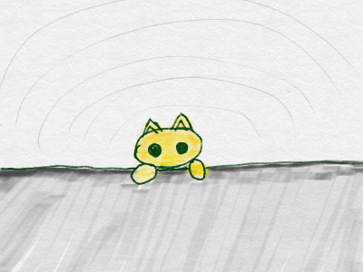

# Sprite1のサイズを小(ちい)さくする

初期(しょき)Spriteのサイズを小(ちい)さくします。ネコが主張(しゅちょう)しないように、見(み)た目(め)を小(ちい)さくしましょう。

 
 

### (1) Sprite1のスクリプト画面を開く
##### (1-1) 左下のSprite1をクリックする
##### (1-2) スクリプトタブをクリックする

 
 

### (2) スクリプトを追加する

 
 

#### (3) 確認する

##### (3-1) 右上の緑の旗をクリックする
##### (3-2) ネコが小さく表示されること

 
 
#### (4) Good!!

よくできました。次(つぎ)のステップに進(すす)みましょう。

