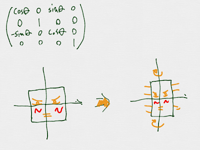
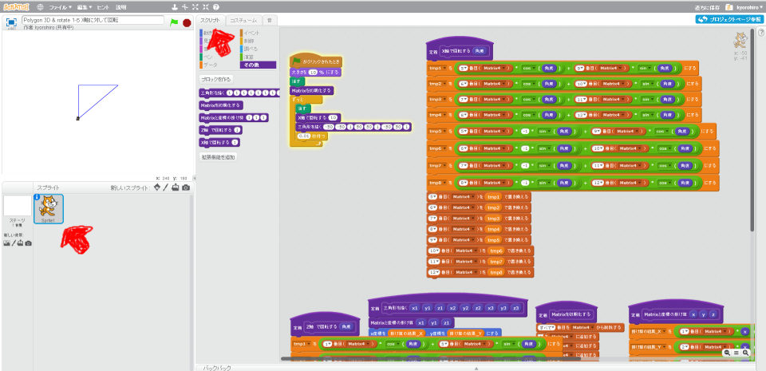
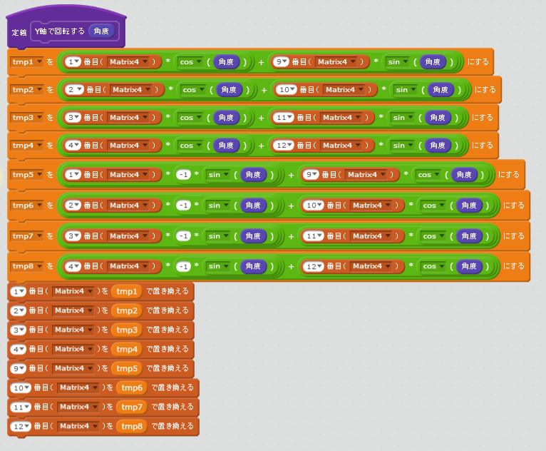
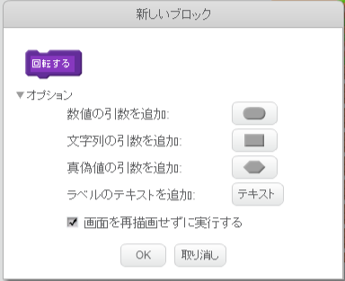
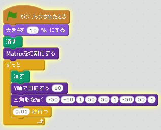
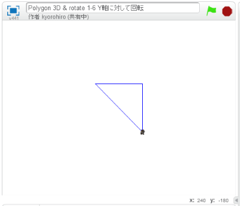

# Y軸(じく)で回転(かいてん)する

 
 

## 回転(かいてん)した後(あと)の値(あたい)
$$ 
\left(
  \begin{array}{ccc}
    a_{11} & a_{12} & a_{13} & a_{14}\\
    a_{21} & a_{22} & a_{23} & a_{24}\\
    a_{31} & a_{32} & a_{33} & a_{34}\\
    a_{41} & a_{42} & a_{43} & a_{44}\\
  \end{array}
\right)
\left(\begin{array}{ccc}
\cos\theta & 0 & \sin\theta & 0 \\
0 & 1 & 0 & 0 \\
-\sin\theta & 0 & \cos\theta & 0 \\
0 & 0 & 0 & 1 \\
\end{array}
\right)
=
\left(
  \begin{array}{ccc}
    M_{11} & a_{12} & M_{13} & a_{14}\\
    M_{21} & a_{22} & M_{23} & a_{24}\\
    M_{31} & a_{32} & M_{33} & a_{34}\\
    M_{41} & a_{42} & M_{43} & a_{44}\\
  \end{array}
\right)
$$

$$\\
M_{11} = a_{11} \times \cos\theta + a_{13} \times \sin\theta \\
M_{21} = a_{21} \times \cos\theta + a_{23} \times \sin\theta \\
M_{31} = a_{31} \times \cos\theta + a_{33} \times \sin\theta \\
M_{41} = a_{41} \times \cos\theta + a_{43} \times \sin\theta \\
$$

$$\\
M_{13} = a_{11} \times -\sin\theta + a_{23} \times \cos\theta \\
M_{23} = a_{21} \times -\sin\theta + a_{23} \times \cos\theta \\
M_{33} = a_{31} \times -\sin\theta + a_{33} \times \cos\theta \\
M_{43} = a_{41} \times -\sin\theta + a_{43} \times \cos\theta \\
$$

 
 
## Scratchで実装(じっそう)してみよう

### (1) スクリプト画面(がめん)を表示(ひょうじ)

##### (1-1) 左下(ひだりした)のSprite1をクリック
##### (1-2) スクリプトタブをクリック

 
 
 

### (2) 回転(かいてん)スクリプトを追加(ついか)

 
 
### (2-注) 

##### ブロックを作成(さくせい)するときは、「画面を再描画せずに実行する」チェックを入(い)れること

 
 
### (3) 確認(かくにん)する

##### (3-1) 旗(はた)がクリックされた時(とき)の、コードを変更(へんこう)する

 
 
https://scratch.mit.edu/projects/88153625/

##### (3-2) 右上(みぎうえ)の旗(はた)をクリック
##### (3-3) 三角形(さんかっけい)が回転(かいてん)すること

 
 

### (4) Good!

