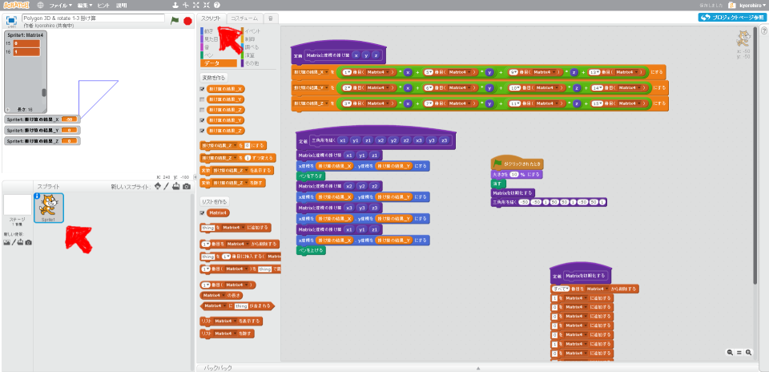
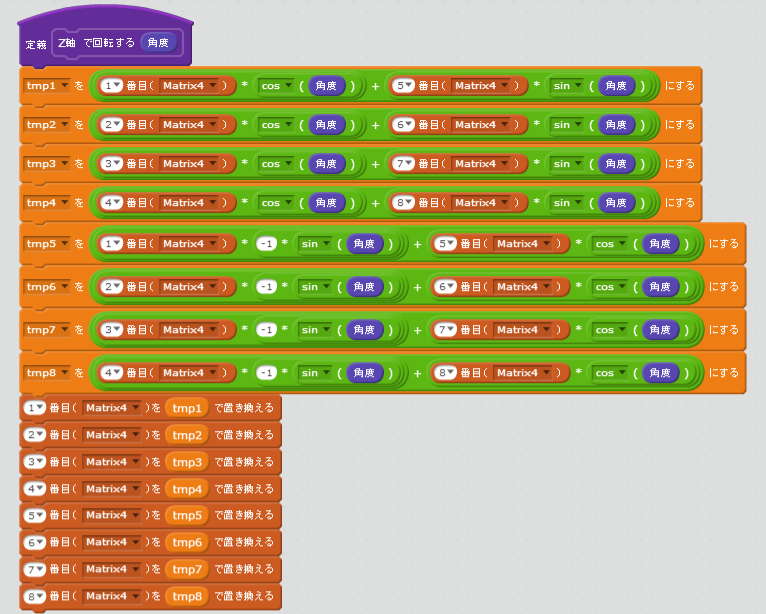
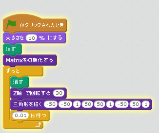
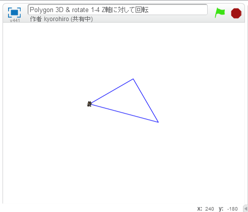
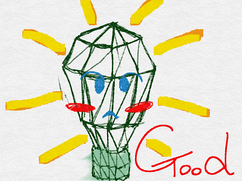

# Z軸で回転する

見た目が変わらないのはここまで。ポリゴンを回転させて見ましょう。

$$ 
\left(\begin{array}{ccc}
\cos\theta & -\sin\theta & 0 & 0\\
\sin\theta & \cos\theta & 0 & 0\\
0 & 0 & 1 & 0\\
0 & 0 & 0 & 1\\
\\
\end{array}
\right)
$$

 
 

## 行列同士の掛け算
$$ 
\left(
  \begin{array}{ccc}
    a_{11} & a_{12} & a_{13} & a_{14}\\
    a_{21} & a_{22} & a_{23} & a_{24}\\
    a_{31} & a_{32} & a_{33} & a_{34}\\
    a_{41} & a_{42} & a_{43} & a_{44}\\
  \end{array}
\right)
\left(
\begin{array}{ccc}
    b_{11} & b_{12} & b_{13} & b_{14}\\
    b_{21} & b_{22} & b_{23} & b_{24}\\
    b_{31} & b_{32} & b_{33} & b_{34}\\
    b_{41} & b_{42} & b_{43} & b_{44}\\
\end{array}
\right) =
\left(
\begin{array}{ccc}
M_{11} & M_{12} & M_{13} & M_{14}\\
M_{21} & M_{22} & M_{23} & M_{24}\\
M_{31} & M_{32} & M_{33} & M_{34}\\
M_{41} & M_{42} & M_{43} & M_{44}\\
\end{array}
\right)
$$
 
 

$$\\
M_{11} = a_{11} \times b_{11} + a_{12} \times b_{21} + a_{13} \times b_{31} + a_{14} \times b_{41}\\
M_{21} = a_{21} \times b_{11} + a_{22} \times b_{21} + a_{23} \times b_{31} + a_{24} \times b_{41}\\
M_{31} = a_{31} \times b_{11} + a_{32} \times b_{21} + a_{33} \times b_{31} + a_{34} \times b_{41}\\
M_{41} = a_{41} \times b_{11} + a_{42} \times b_{21} + a_{43} \times b_{31} + a_{44} \times b_{41}\\
$$
$$\\
M_{12} = a_{11} \times b_{12} + a_{12} \times b_{22} + a_{13} \times b_{32} + a_{14} \times b_{42}\\
M_{22} = a_{21} \times b_{12} + a_{22} \times b_{22} + a_{23} \times b_{32} + a_{24} \times b_{42}\\
M_{32} = a_{31} \times b_{12} + a_{32} \times b_{22} + a_{33} \times b_{32} + a_{34} \times b_{42}\\
M_{42} = a_{41} \times b_{12} + a_{42} \times b_{22} + a_{43} \times b_{32} + a_{44} \times b_{42}\\
$$
$$\\
M_{13} = a_{11} \times b_{13} + a_{12} \times b_{23} + a_{13} \times b_{33} + a_{14} \times b_{43}\\
M_{23} = a_{21} \times b_{13} + a_{22} \times b_{23} + a_{23} \times b_{33} + a_{24} \times b_{43}\\
M_{33} = a_{31} \times b_{13} + a_{32} \times b_{23} + a_{33} \times b_{33} + a_{34} \times b_{43}\\
M_{43} = a_{41} \times b_{13} + a_{42} \times b_{23} + a_{43} \times b_{33} + a_{44} \times b_{43}\\
$$
$$\\
M_{14} = a_{11} \times b_{14} + a_{12} \times b_{24} + a_{13} \times b_{34} + a_{14} \times b_{44}\\
M_{24} = a_{21} \times b_{14} + a_{22} \times b_{24} + a_{23} \times b_{34} + a_{24} \times b_{44}\\
M_{34} = a_{31} \times b_{14} + a_{32} \times b_{24} + a_{33} \times b_{34} + a_{34} \times b_{44}\\
M_{44} = a_{41} \times b_{14} + a_{42} \times b_{24} + a_{43} \times b_{34} + a_{44} \times b_{44}\\
$$

 
 

## 回転した後の値
$$ 
\left(
  \begin{array}{ccc}
    a_{11} & a_{12} & a_{13} & a_{14}\\
    a_{21} & a_{22} & a_{23} & a_{24}\\
    a_{31} & a_{32} & a_{33} & a_{34}\\
    a_{41} & a_{42} & a_{43} & a_{44}\\
  \end{array}
\right)
\left(\begin{array}{ccc}
\cos\theta & -\sin\theta & 0 & 0\\
\sin\theta & \cos\theta & 0 & 0\\
0 & 0 & 1 & 0\\
0 & 0 & 0 & 1\\
\end{array}
\right)
=
\left(
  \begin{array}{ccc}
    M_{11} & M_{12} & a_{13} & a_{14}\\
    M_{21} & M_{22} & a_{23} & a_{24}\\
    M_{31} & M_{32} & a_{33} & a_{34}\\
    M_{41} & M_{42} & a_{43} & a_{44}\\
  \end{array}
\right)
$$

$$\\
M_{11} = a_{11} \times \cos\theta + a_{12} \times \sin\theta \\
M_{21} = a_{21} \times \cos\theta + a_{22} \times \sin\theta \\
M_{31} = a_{31} \times \cos\theta + a_{32} \times \sin\theta \\
M_{41} = a_{41} \times \cos\theta + a_{42} \times \sin\theta \\
$$

$$\\
M_{12} = a_{11} \times -\sin\theta + a_{12} \times \cos\theta \\
M_{22} = a_{21} \times -\sin\theta + a_{22} \times \cos\theta \\
M_{32} = a_{31} \times -\sin\theta + a_{32} \times \cos\theta \\
M_{42} = a_{41} \times -\sin\theta + a_{42} \times \cos\theta \\
$$

 
 
## Scratchで実装してみよう

### (1) スクリプト画面を表示

##### (1-1) 左下のSprite1をクリック
##### (1-2) スクリプトタブをクリック

 
 
 

### (2) 回転スクリプトを追加

 
 

### (3) 確認する

 
 

### (4) Good!

https://scratch.mit.edu/projects/88091699/