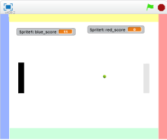

# Pong
http://www.ponggame.org

Pongは一般向(いっぱんむ)けのTVゲームという分野(ぶんや)が、誕生(たんじょう)する、きっかけになったゲームです。
1972年(ねん)11月(がつ)にアタリ社(しゃ)で開発(かいはつ)されました。

Pongは対戦(たいせん)ゲームです。左右(さゆう)に配置(はいち)されたラケットを、上下(じょうげ)に移動(いどう)させて、ボールを打(う)ち返(かえ)すゲームです。

相手(あいて)にラケットで打(う)ち返(かえ)すことを失敗(しっぱい)させると、得点(とくてん)が入(はい)ります。

先(さき)に15点(てん)を先取(せんしゅ)したほうが勝(か)ちとなります。

## Scratchで作成してみよう

https://scratch.mit.edu/projects/77999912/

ボールが青色の部分に衝突すると、右側に得点が入ります。ボールが赤色の部分に衝突すると、左側に得点が入ります。
上キー、下キーを押すと、灰色のラケットが上下に移動します。
Aキー、Zキーを押すと、黒色にラケットが上下に移動します。

ボールにラケットが衝突すると跳ね返ります。

