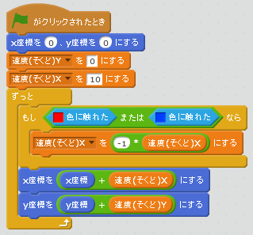
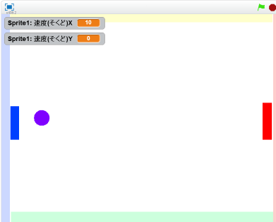
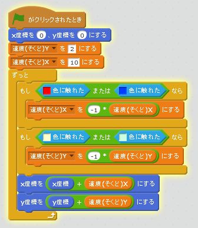

# ボールが跳(は)ね返(かえ)る機能(きのう)を追加(ついか)

#### (1) ラケットに当たるとボールが跳ね返る機能をついか

##### (1-1) ボールSpriteに以下のスクリプトを追加してください

##### (1-2) 確認してみよう
https://scratch.mit.edu/projects/78420962/

######(1-2-1) 右上の緑色の旗をクリックすると、ボールがラケットで跳ね返って左右に移動します

#### (2) 壁に衝突するとボールが跳ね返る機能をついか
##### (2-1) ボールSpriteに以下のスクリプトを追加してください

##### (2-2) 確認してみよう
https://scratch.mit.edu/projects/78430612/

######(1-2-1) 右上の緑色の旗をクリックすると、ボールがラケットボールに跳ね返って上下左右に移動します