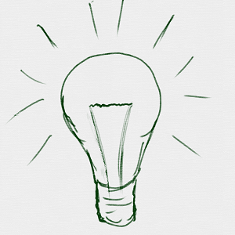

# ボールが跳(は)ね返(かえ)る機能(きのう)を追加(ついか)

ボールが跳(は)ね返(かえ)る機能(きのう)を追加(ついか)してみましょう。

 
 
 

### (1) ラケットに当(あ)たるとボールが跳(は)ね返(か)る機能(きのう)をついか

#### (1-1) ボールSpriteに以下(いか)のスクリプトを追加(ついか)してください

**※ 「Yの速度(そくど)」変数(へんすう)を作(つく)るときは、「このSpriteのみ」にチェックを入れてください**

**※ 「Xの速度(そくど)」変数(へんすう)を作(つく)るときは、「このSpriteのみ」にチェックを入れてください**

 
 
 

### (2) 確認(かくにん)してみよう
https://scratch.mit.edu/projects/78420962/

#### (2-1) 右上(みぎうえ)の緑色(みどり)の旗(はた)をクリックすると、ボールがラケットで跳(は)ね返(かえ)って左右(さゆう)に移動(いどう)します

 
 
 

### (3) Good!

 
 
 

### (4) 壁(かべ)に衝突(しょうとつ)するとボールが跳(は)ね返(かえ)る機能(きのう)をついか
##### (4-1) ボールSpriteに以下(いか)のスクリプトを追加(ついか)してください

**※ 「Yの速度(そくど)」変数(へんすう)を作(つく)るときは、「このSpriteのみ」にチェックを入れてください**

**※ 「Xの速度(そくど)」変数(へんすう)を作(つく)るときは、「このSpriteのみ」にチェックを入れてください**

 
 
 

### (5) 確認(かくにん)してみよう
https://scratch.mit.edu/projects/78430612/

##### (5-1) 右上(みぎうえ)の緑色(みどりいろ)の旗(はた)をクリックすると、ボールがラケットボールに跳(は)ね返(かえ)って上下(じょうげ)左右(さゆう)に移動(いどう)します

