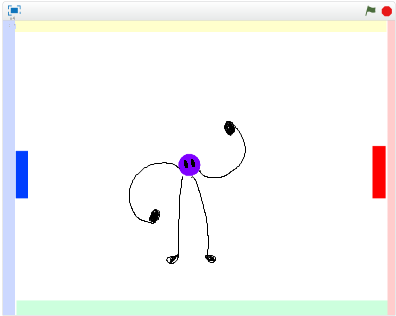
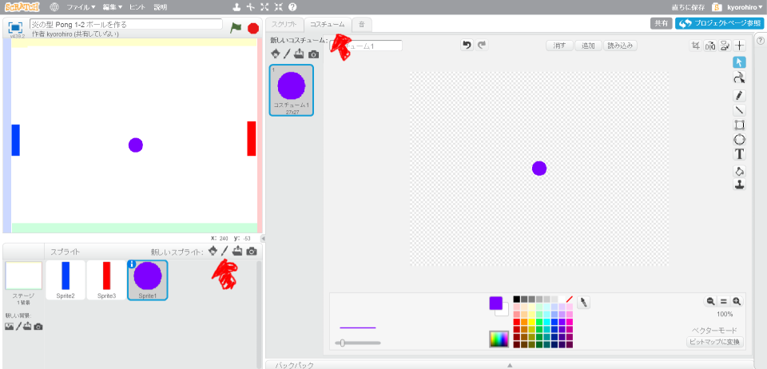
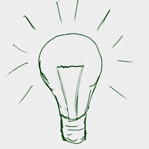

# ボールを追加(ついか)

https://scratch.mit.edu/projects/78444962/

次(つぎ)は、ボールを追加(ついか)してみましょう。

 
 
 

#### (1) ボールSpriteを追加(ついか)します

##### (1-1) 左下(ひだりした)の鉛筆(えんぴつ)アイコンとクリック
##### (1-2) 右上(みぎうえ)の「コスチュームタグ」をクリック
##### (1-3) お絵(え)かきツールで、上図(じょうず)のように、中心(ちゅうしん)にボールを書(か)いてください

 
 
 

### (2) Good!!

良(よ)くできました。次(つぎ)のステップに進(すすみ)みましょう!!

