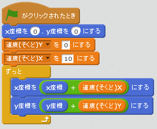
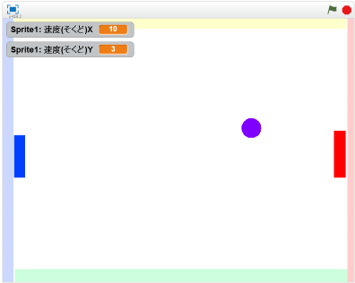

# ボールを追加(ついか)

https://scratch.mit.edu/projects/78444962/

#### (2) ボールが右(みぎ)に移動(いどう)するスクリプトを追加(ついか)
##### (2-1) ボールスクリプト画面(がぞう)を表示(ひょうじ)する
###### (2-1-1) 左下(ひだりした)のボールクリック
###### (2-1-2) 右上(みぎうえ)のスクリプトタブをクリック
##### (2-2) 下記(かき)スクリプトを追加(ついか)する

**※ 「Yの速度(そくど)」変数(へんすう)を作(つく)るときは、「このSpriteのみ」にチェックを入れてください**

**※ 「Xの速度(そくど)」変数(へんすう)を作(つく)るときは、「このSpriteのみ」にチェックを入れてください**

#### (3) 確認(かくにん)してみよう
https://scratch.mit.edu/projects/78444962/

上手(うま)く書(か)けたか確認(かくにん)してみましょう

##### (3-1) 右上(みぎうえ)の緑色(みどりいろ)の旗(はた)をクリックすると、ボールが右(みぎ)に移動(いどう)します。