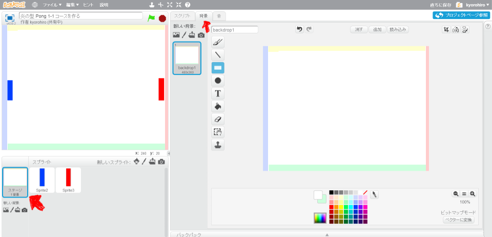

# コースを追加(ついか)しましょう
https://scratch.mit.edu/projects/78418540/

#### (1) 背景(はいけい)に色(いろ)を塗(ぬ)る
今回(こんかい)、作成(さくせい)するコースは背景色(はいけいしょく)に意味(いみ)を持(も)たせています。
左(ひだり)、右(みぎ)、上(うえ)、下(した)、ラケットには、すべて異(こと)なる色(いろ)をりようしてください。

「黄色(きいろ)は下(した)にボールを跳(は)ね返(かえ)す」「緑(みどり)は上(うえ)にボールを跳(は)ね返(かえ)す」といった意味(いみ)を後(あと)で持(も)たせます。

##### (1-1) 左下(ひだりした)の「ステージ1背景」をクリック
##### (1-2) 右上(みぎうえ)の背景(はいけい)タブをクリック
##### (1-3) お絵(え)かきツールで、上記(じょうき)の画像(がぞう)のように色(いろ)を塗(ぬ)ってください。

