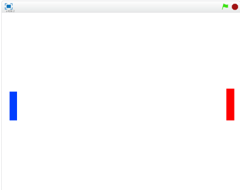

# ラケットを作(つく)る
https://scratch.mit.edu/projects/78407350/

#### (1) 赤と青のラケットを作成する。

##### (1-1) 左下にある鉛筆マークをクリックして、Spriteを追加(ついか)する
##### (1-2) 画面中央に青色の長方形をかく
##### (1-3) 左下にある鉛筆マークをクリックして、Spriteを追加()する
##### (1-4) 画面中央に赤色
の長方形をかく

#### (2) Sprite1 を削除する
猫(ねこ)のSprite(スプライト)は使(つか)わないので削除(さくじょ)しましょう。

##### (2-1) Sprite1の上にマウスカーソルを合わせる
##### (2-2) 右(みぎ)クリックする
##### (2-3) メニューから削除(さくじょ)を選(えら)ぶ

#### (3)赤色ラケットにスクリプトを追加する
上下に移動するスクリプトを追加しましょう
##### (3-1) 左下のラケットをクリックする
##### (3-2) 右上のスクリプトタブをクリックする

##### (3-3) 下記スクリプトを追加してください

#### (4) 青色ラケットにスクリプトを追加する
赤色ラケットにスクリプトを追加したように、青色にラケットにスクリプト画面を開いて、下記スクリプトを追加してください。

#### (5) 確認してみよう

https://scratch.mit.edu/projects/78407350/

###### (5-1) 右上(むぎうえ)の緑色(みどりいろ)の旗(はた)をクリックしてください
###### (5-2) 上(うえ)キーを押(お)すと赤色(あかいろ)のラケットが上(うえ)に移動(いどう)します
###### (5-3) 下(した)キーを押(お)すと赤色(あかいろ)のラケットが下(した)に移動(いどう)します
###### (5-4) Aキーを押(お)すと青色(あおいろ)のラケットが上(うえ)に移動(いどう)します
###### (5-5) Zキーを押(お)すと青色(あおいろ)のラケットが下(した)に移動(いどう)します

