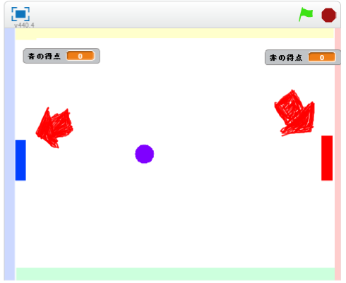

# ラケットを作(つく)る
https://scratch.mit.edu/projects/78407350/

では、Pongを作っていきます。

まずは、この上下(上下)に動(うご)く赤色(あかいろ)と青色(あおいろ)のラケットを作成(さくせい)してみましょう。

 
 
 

#### (1) 赤(あか)と青(あお)のラケットを作成(さくせい)する。

##### (1-1) 左下(ひだりした)にある鉛筆(えんぴつ)マークをクリックして、Spriteを追加(ついか)する
##### (1-2) 画面中央(がめんちゅうおう)に青色(あおいろ)の長方形(ちょうほうけい)をかく
##### (1-3) 左下(ひだりした)にある鉛筆(えんぴつ)マークをクリックして、Spriteを追加(ついか)する
##### (1-4) 画面中央(がめんちゅうおう)に赤色(あかいろ)の長方形(ちょうほうけい)をかく

 
 
 

#### (2) Sprite1 を削除(さくじょ)する
はい、ラケットが作成(さくせい)できました。猫(ねこ)のSprite(スプライト)は使(つか)わないので削除(さくじょ)しましょう。

##### (2-1) Sprite1の上にマウスカーソルを合わせる
##### (2-2) 右(みぎ)クリックする
##### (2-3) メニューから削除(さくじょ)を選(えら)ぶ

 
 
 
...

...

..

..

