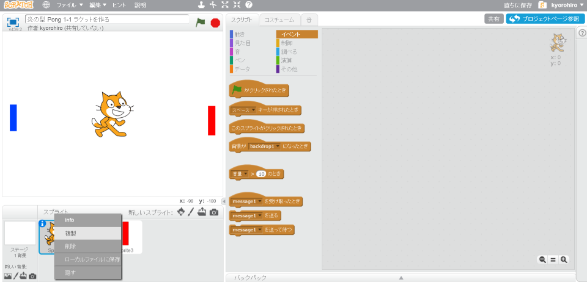
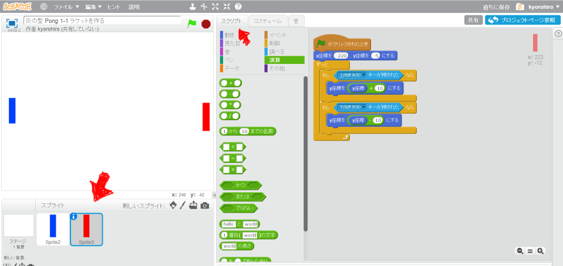
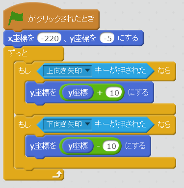
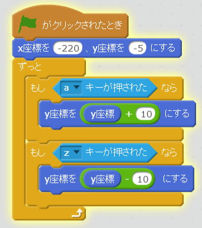

# ラケットを作(つく)る
https://scratch.mit.edu/pついかrojects/78407350/

#### (1) ラケットを作成する。

##### (1-1) 左下にある鉛筆マークをクリックして、Spriteを追加(ついか)する
##### (1-2) 画面中央に青色の長方形をかく
##### (1-3) 左下にある鉛筆マークをクリックして、Spriteを追加()する
##### (1-4) 画面中央に赤色
の長方形をかく

