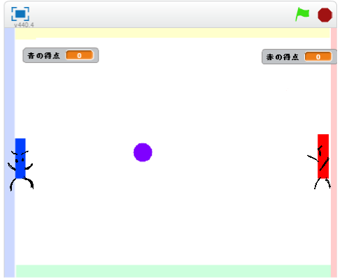

# ラケットを作(つく)る
https://scratch.mit.edu/projects/78407350/

では、Pongを作っていきます。

まずは、この上下(上下)に動(うご)く赤色(あかいろ)と青色(あおいろ)のラケットを作成(さくせい)してみましょう。

 
 
 

### (1) 青(あお)のラケットを作成(さくせい)する。

##### (1-1) 左下(ひだりした)にある鉛筆(えんぴつ)マークをクリックして、Spriteを追加(ついか)する
##### (1-2) 画面中央(がめんちゅうおう)に青色(あおいろ)の長方形(ちょうほうけい)をかく
 
 
### (2) 赤(あか)のラケットを作成(さくせい)する。
##### (2-1) 左下(ひだりした)にある鉛筆(えんぴつ)マークをクリックして、Spriteを追加(ついか)する
##### (2-2) 画面中央(がめんちゅうおう)に赤色(あかいろ)の長方形(ちょうほうけい)をかく

 
 
 

### (3) Sprite1 を削除(さくじょ)する
はい、ラケットが作成(さくせい)できました。猫(ねこ)のSprite(スプライト)は使(つか)わないので削除(さくじょ)しましょう。

##### (3-1) Sprite1の上にマウスカーソルを合わせる
##### (3-2) 右(みぎ)クリックする
##### (3-3) メニューから削除(さくじょ)を選(えら)ぶ

 
 
 

### (4) 確認(かくにん)する!!
##### (4-1) 画面(がめん)に赤(あか)と青(あお)のラケットが表示(ひょうじ)されていれば成功(せいこう)です。

 
 
 

### (5) Good!!
良(よ)くできました。次(つぎ)のステップに進(すすみ)みましょう!!

