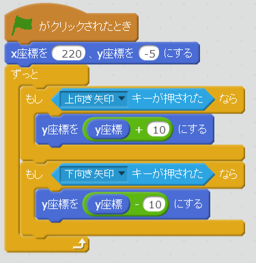

# ラケットを上下(じょうげ)に移動(いどう)できるようにする

https://scratch.mit.edu/projects/78407350/

はい、ラケットを作(つく)ることができました。しかし、まだ何(なに)も動作(どうさ)しません。

「上(うえ)キーを押(お)したら上(うえ)に移動(いどう)する」「下(した)キーを押(お)したら下(した)に移動(いどう)する」といった機能(きのう)を追加(ついか)してみましょう。

 
 
 

### (1)赤色(あかいろ)ラケットにスクリプトを追加(ついか)する
上下(じょうげ)に移動(いどう)するスクリプトを追加(ついか)しましょう
##### (1-1) 左下(ひだりした)のラケットをクリックする
##### (1-2) 右上(みぎうえ)のスクリプトタブをクリックする

##### (1-3) 下記(かき)スクリプトを追加(ついか)してください

 
 
 

### (2) 青色(あおいろ)ラケットにスクリプトを追加(ついか)する
赤色(あかいろ)ラケットにスクリプトを追加(ついか)したように、青色(あおいろ)にラケットにスクリプト画面(がめん)を開(ひら)いて、下記(かき)スクリプトを追加(ついか)してください。

 
 
 

### (3) 確認してみよう

https://scratch.mit.edu/projects/78407350/

###### (3-1) 右上(むぎうえ)の緑色(みどりいろ)の旗(はた)をクリックしてください
###### (3-2) 上(うえ)キーを押(お)すと赤色(あかいろ)のラケットが上(うえ)に移動(いどう)します
###### (3-3) 下(した)キーを押(お)すと赤色(あかいろ)のラケットが下(した)に移動(いどう)します
###### (3-4) Aキーを押(お)すと青色(あおいろ)のラケットが上(うえ)に移動(いどう)します
###### (3-5) Zキーを押(お)すと青色(あおいろ)のラケットが下(した)に移動(いどう)します

 
 
 

### (4) Good !!
良(よ)くできました。次(つぎ)のステップに進(すすみ)みましょう!!

