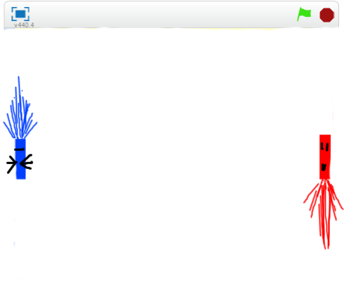

# ラケットを上下(じょうげ)に移動(いどう)できるようにする

https://scratch.mit.edu/projects/78407350/

ラケットを作ることができました。しかし、まだ何も動作しません。
「上キーを押したら上に移動する」「下キーを押したら下に移動する」といぅた機能を追加してみましょう。

#### (3)赤色(あかいろ)ラケットにスクリプトを追加(ついか)する
上下(じょうげ)に移動(いどう)するスクリプトを追加(ついか)しましょう
##### (3-1) 左下(ひだりした)のラケットをクリックする
##### (3-2) 右上(みぎうえ)のスクリプトタブをクリックする

##### (3-3) 下記(かき)スクリプトを追加(ついか)してください

#### (4) 青色(あおいろ)ラケットにスクリプトを追加(ついか)する
赤色(あかいろ)ラケットにスクリプトを追加(ついか)したように、青色(あおいろ)にラケットにスクリプト画面(がめん)を開(ひら)いて、下記(かき)スクリプトを追加(ついか)してください。

 
 
 

#### (5) 確認してみよう

https://scratch.mit.edu/projects/78407350/

###### (5-1) 右上(むぎうえ)の緑色(みどりいろ)の旗(はた)をクリックしてください
###### (5-2) 上(うえ)キーを押(お)すと赤色(あかいろ)のラケットが上(うえ)に移動(いどう)します
###### (5-3) 下(した)キーを押(お)すと赤色(あかいろ)のラケットが下(した)に移動(いどう)します
###### (5-4) Aキーを押(お)すと青色(あおいろ)のラケットが上(うえ)に移動(いどう)します
###### (5-5) Zキーを押(お)すと青色(あおいろ)のラケットが下(した)に移動(いどう)します

