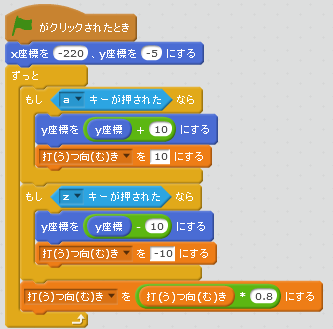
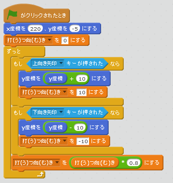
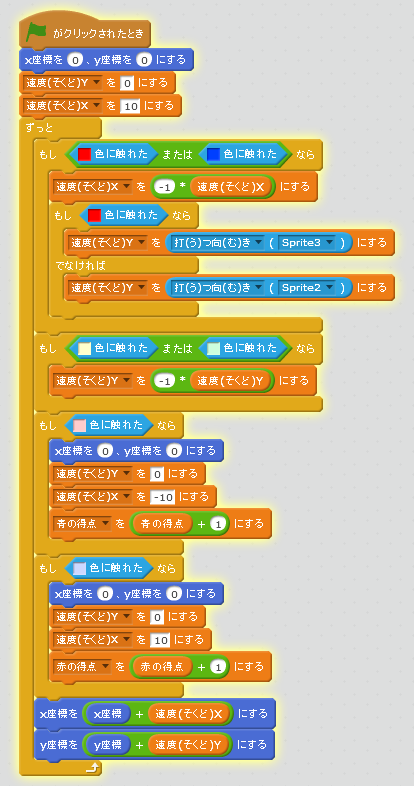

# ボールが跳ね返る角度を変える
https://scratch.mit.edu/projects/78437120/#player

上下に移動する操作に応じて、ボールが跳ね返る向きを調整する機能を追加します

#### (1) 青色のラケットに、移動したタイミングに応じて打つ向きを決める
##### (1-1) 下記スクリプトを追加してください

#### (2) 赤色のラケットに、移動したタイミングに応じて打つ向きを決める
##### (2-1) 下記スクリプトを追加してください

#### (3) ラケット記録したをもとに、ボールが跳ね返る向きを決める
##### (3-1) 下記スクリプトを追加してください

#### (4) 確認しよう
https://scratch.mit.edu/projects/78437120/#player
##### (4-1)