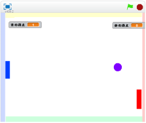

# ボールが跳(は)ね返(かえ)る角度(かくど)を変(か)える
https://scratch.mit.edu/projects/78437120/#player

上下(じょうげ)に移動(いどう)する操作(そうさ)に応(おう)じて、ボールが跳(は)ね返(かえ)る向(む)きを調整(ちょうせい)する機能(きのう)を追加(ついか)します

#### (1) 青色(あおいろ)のラケットに、移動(いどうした)したタイミングに応(おう)じて打(う)つ向(む)きを決(き)める

##### (1-1) 青色(あおいろ)のラケットに下記(かき)スクリプトを追加(ついか)してください

**※ 「打(う)つ向(む)き」変数(へんすう)を作(つく)るときは、「このSpriteのみ」にチェックを入れてください**

#### (2) 赤色(あかいろ)のラケットに、移動(いどう)したタイミングに応(おう)じて打(う)つ向(む)きを決(き)める
##### (2-1) 赤色(あかいろ)のラケットに、下記(かき)スクリプトを追加(ついか)してください

**※ 「打(う)つ向(む)き」変数(へんすう)を作(つく)るときは、「このSpriteのみ」にチェックを入(い)れてください**

#### (3) ラケット記録(きろく)したをもとに、ボールが跳(は)ね返(かえ)る向(む)きを決(き)める
##### (3-1) 下記(かき)スクリプトを追加(ついか)してください

**※ 「Yの速度(そくど)」変数(へんすう)を作(つく)るときは、「このSpriteのみ」にチェックを入れてください**

**※ 「Xの速度(そくど)」変数(へんすう)を作(つく)るときは、「このSpriteのみ」にチェックを入れてください**

**※ 「赤の得点」変数(へんすう)を作(つく)るときは、「すべてのSpriteよう」にチェックを入れてください**

**※ 「青の得点」変数(へんすう)を作(つく)るときは、「すべてのSpriteよう」にチェックを入れてください**

#### (4) 確認(かくにん)しよう
https://scratch.mit.edu/projects/78437120/#player

##### (4-1) ボールがラケットに当(あ)たる瞬間(しゅんかん)にラケットを移動(いどう)すると移動(いどう)した向(む)きに、ボールが移動(いどう)すること
